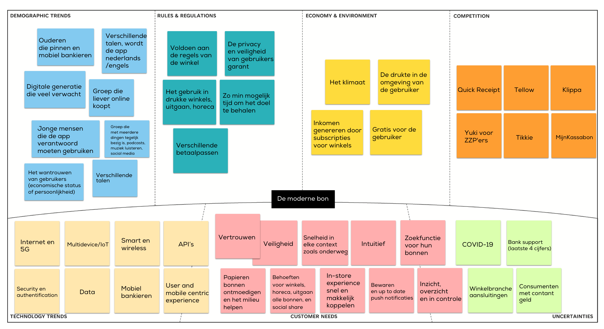

# Context Mapping

<figure><figcaption>
Context map v1
</figcaption></figure>

Op basis van de inzichten in deze context kan ik rekening houden met de trends, en behoeften. En apps of ideeen die al gedaan zijn, de app moet natuurlijk uniek zijn. Dat doe ik door de api, smart en wireless behoeften te combineren. Mijn app is automatisch, je bewaart bonnen tijdens het betalen. Dat is anders dan Quick Receipt of Klippa. Daarnaast wil ik kosten met een bewijs delen. in de toekomst,  dat doet Tikkie niet. \
\
Dit soort patronen leg ik naast elkaar om na te denken in welke context de doelgroep iets wil gebruiken. Een ander voorbeeld is, de snelheid die de consument in de winkel verwacht, dat moet samen gaan met een veilige omgeving, via internet, en intuitief/met een zoekfunctie MOET werken. &#x20;
