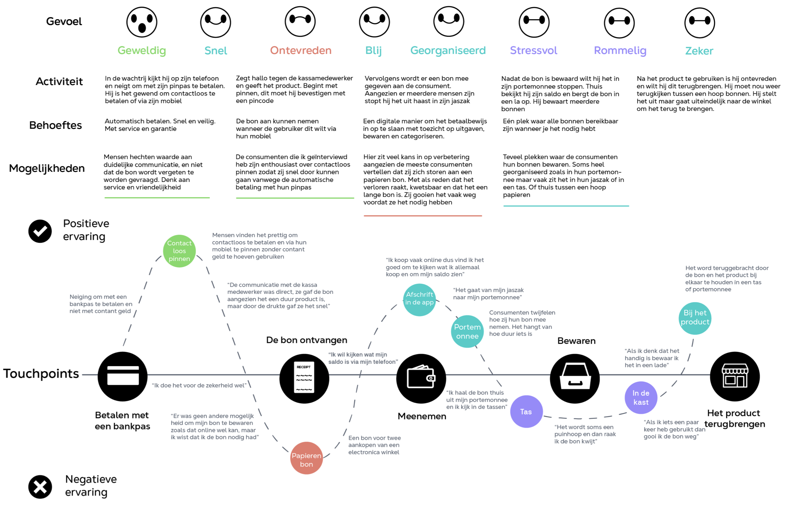

# Customer Journey

<figure><figcaption>
Customer Journey v1
</figcaption></figure>

Ik heb de customer journey op basis van de ervaring van de doelgroep gemaakt. Met touchpoints en waar het voor hun gevoel misgaat. Ik vind het bijvoorbeeld interessant dat de positieve ervaring met contactloos pinnen heel hoog zit, en naarmate we weer teruggaan naar een papieren bon dit als extreem negatief wordt ervaren. \
\
In de Customer journey wil ik alle momenten van de consument onthouden, vanaf de betaling en een bon ergens bewaren en vanuit thuis weer terugbrengen. Als je de bon nog hebt bewaart. Dat ligt aan hoe geordend de persoon is. Maar het feit dat de papieren bon zo negatief wordt ervaren is reden genoeg voor mijn idee. Aangezien er veel mis kan gaan vanaf dit touchpoint (de bon ontvangen).&#x20;
