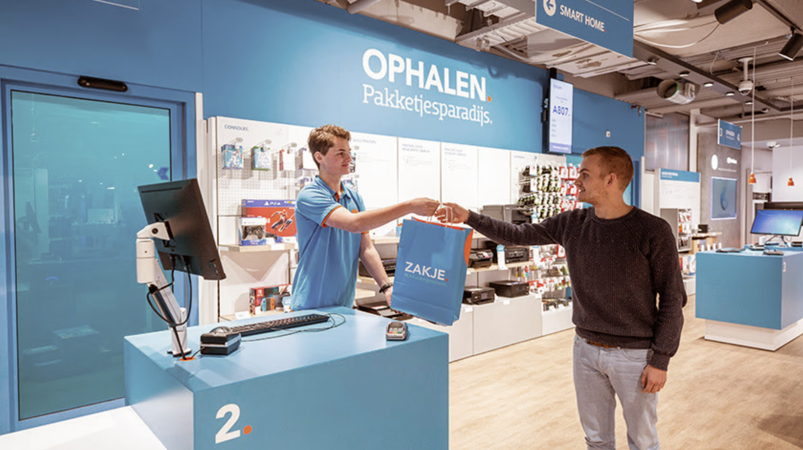
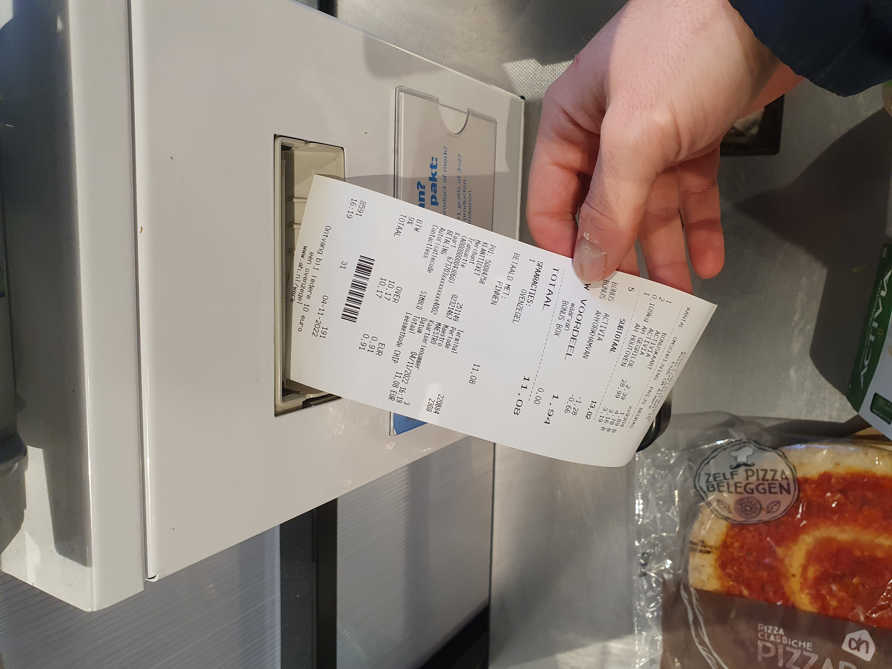
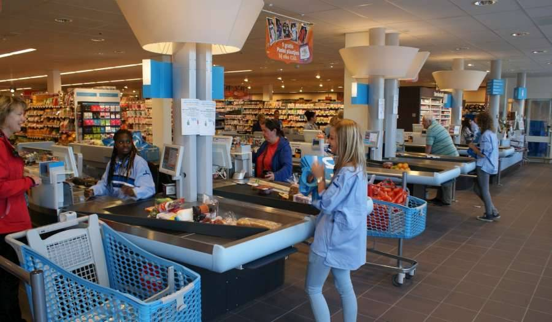

# Observaties

Na mijn Expert Interview met een nauw medewerker bij ABN Ambro heb ik besloten om mij te richten op de winkels en de consument. Naast dat het een stakeholder scheelt kan ik mijn band met winkelbranches en de consument versterken. Het kan niet als intellectueel eigendom worden gezien wat ik wil voorkomen. Alhoewel ik wel onderzoek moet doen naar de bankgegevens die ik nodig heb uit de bon, maar niet zozeer een integratie of en aansluiting met de bank. Dit wil ik puur en alleen uit de bon kunnen halen als dat kan. Samen met een connectie met de winkel. En uiteindelijk de consument om voor te testen.&#x20;

Na deze keuze heb ik besloten om de winkels en de consumenten te observeren, omdat ik nu logische stakeholders heb. Dit wil ik vervolgens in de definiëringsfase gebruiken.\

Locatie 1: **Coolblue belanghebbende**

<figure><figcaption>
Observatie in de Coolblue winkel
</figcaption></figure>

 

<figure><figcaption>
Hoe bewaar je de bon bij Coolblue?
</figcaption></figure>

Locatie 2: Albert Heijn

<figure><figcaption>
Zelfscan observatie
</figcaption></figure>

 

<figure><figcaption>
Verspilling observatie
</figcaption></figure>

 

<figure><figcaption>
Hoe krijg je de bon in de supermarkt
</figcaption></figure>

Locatie 3: Amsterdam Centrum

<figure><figcaption>
Consumenten observeren hoeveel bonnen en hoeveel tassen
</figcaption></figure>

 

<figure><figcaption></figcaption></figure>

 

<figure><figcaption></figcaption></figure>

