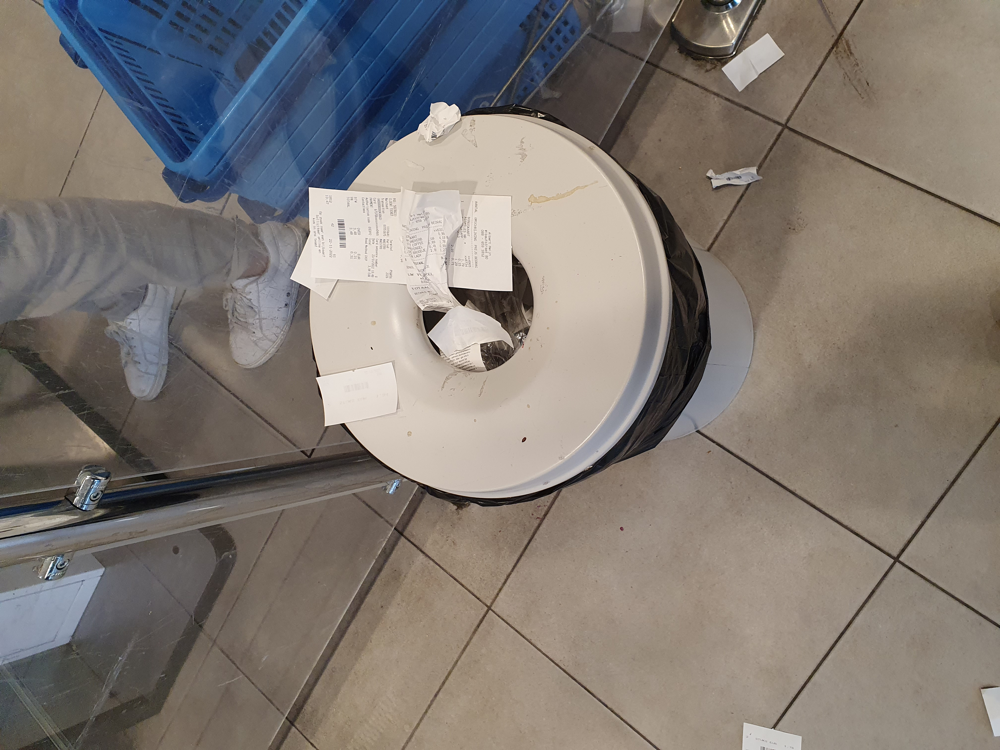

# Observaties

Na het voeren van een Expert Interview met een UX ontwerper bij ABN Ambo en een gesprek met een bankier, heb ik besloten om mij te richten op de winkels en consumenten. Dit heeft meerdere voordelen, waaronder het aantal stakeholders klein houden en het versterken van de winkel en gebruiksbehoeften. Met de winkels voorkom ik dat mijn ideeën als intellectueel eigendom wordt gezien, maar vooral zodat ik mijn prototype kan testen. Dan kan ik in de toekomst met de bank. overleggen. Ik wil de benodigde informatie rechtstreeks vanaf de kassabon gebruiken voor mijn concept. Mijn doel is om een connectie met de winkel en de consument tot stand te brengen voor testdoeleinden. Nu ik deze keuze heb gemaakt, wil ik de winkels en consumenten observeren om dit te kunnen gebruiken in de definieringsfase van mijn onderzoek.

**Coolblue**

Ik ben begonnen met observeren bij Coolblue waar garantie en service erg belangrijk is. Coolblue zet zich in voor gebruiksvriendelijkheid en staat open voor een milieuoplossing. Zij hebben hun eigen app voor kassabonnen. Het is een elektronica zaak waar klanten soms dure producten kopen, daarom willen zij hun kassabon goed kunnen bewaren. Daarom kijk ik hier hoe mensen de bon ontvangen en wat zij hiermee doen.&#x20;

Ongeveer 20% van de consumenten gooit hun kassabonnen van Coolblue weg, omdat ze het willen gebruiken of voor de zekerheid willen bewaren voor hun garantie. Alleen hebben ze geen goede manier op dit op te bergen. Het gebruiksgemak is hier het grootste probleem, gebruikers willen de bon eventueel gebruiken of willen dit op een handige manier bewaren. De kassabon is dat opzicht nog ouderwets. Daarom kan mijn app voor hun handig  zijn als het gaat om hun gemak. \

Locatie 1: **Coolblue belanghebbende**

<figure><figcaption>
Observatie in de Coolblue winkel
</figcaption></figure>

 

<figure><figcaption>
Hoe ontvang je een product bij Coolblue
</figcaption></figure>

**Albert Heijn**

Albert heijn print samen met supermarkten de meeste kassabonnen en niet voor garantie. Soms brengen klanten wel producten terug, maar de meeste kassabonnen zijn volgens mijn geïnterviewden onbelangrijk en eindigen toch in de prullenbak. Hier speelt het milieu dus een grote rol om mijn app voor te gebruiken. Ik heb geobserveerd hoeveel mensen hun bonnen weggooien en ik kijk naar hoe ik een bon ontvang. \
\
Ongeveer 75% van de consumenten gooit hun kassabonnen van de Albert Heijn direct weg, omdat ze deze als onbelangrijk beschouwen of omdat ze deze niet nodig hebben. Daarom kan mijn app voor hen goed zijn als milieuoplossing om een steentje bij te dragen aan het milieu.

<figure><figcaption>
Zelfscan observatie
</figcaption></figure>

 

<figure><figcaption>
Verspilling observatie
</figcaption></figure>

**Amsterdam**

Dit was tijdens mijn interviews op straat, ik observeer de doelgroep en vraag hoe zij hun kassabonnen bewaren. Dit vroeg ik aan mensen die tassen droegen omdat zij het vaak hierin bewaren. &#x20;

<figure><figcaption>
Consumenten observeren 
</figcaption></figure>

 

<figure><figcaption></figcaption></figure>

 

<figure><figcaption></figcaption></figure>

