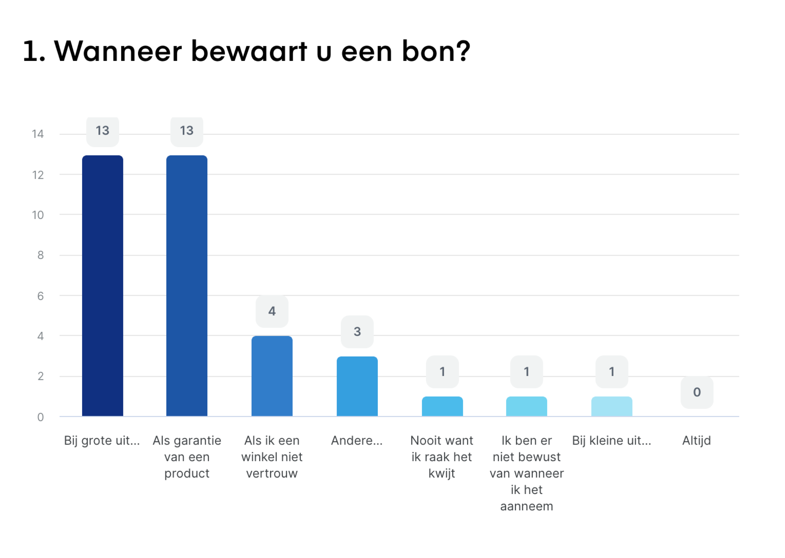
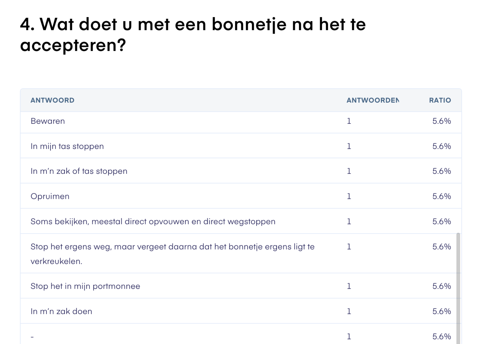
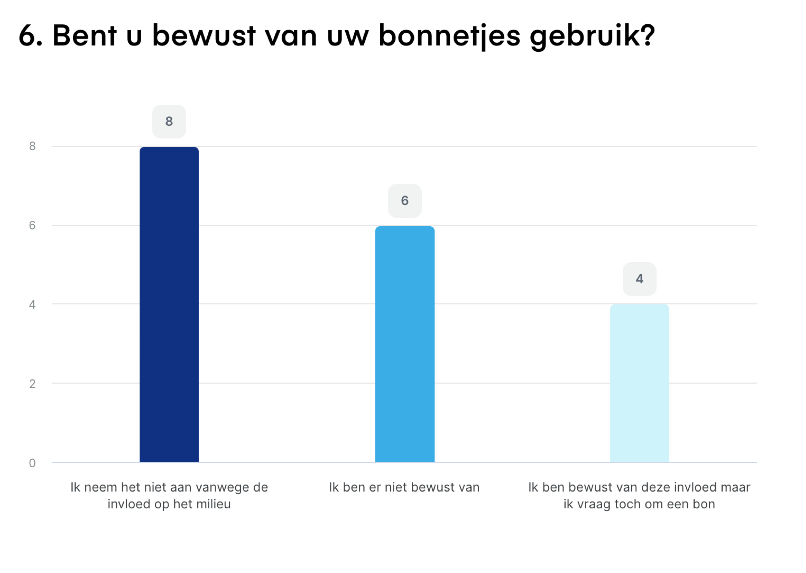
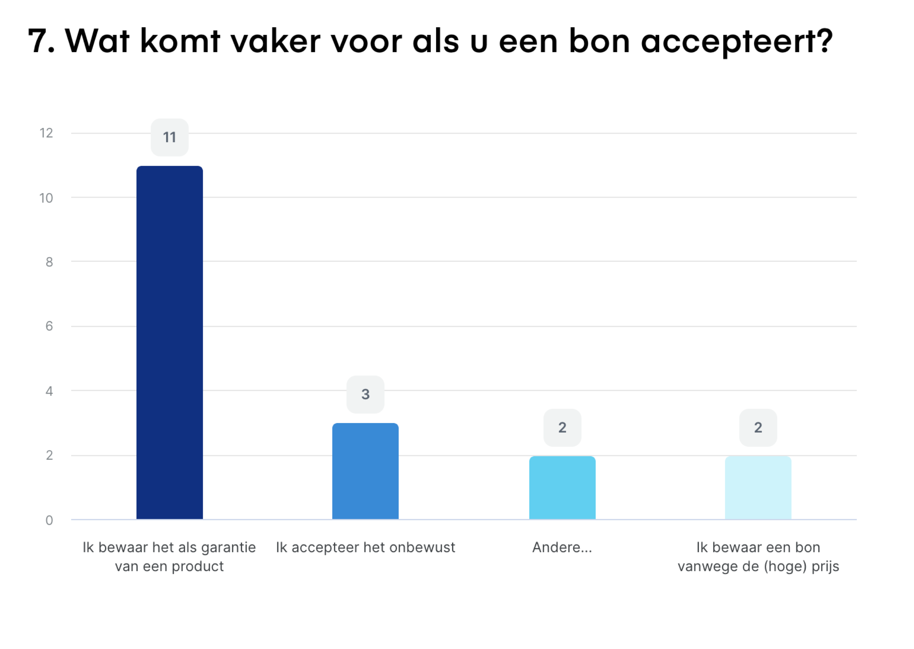
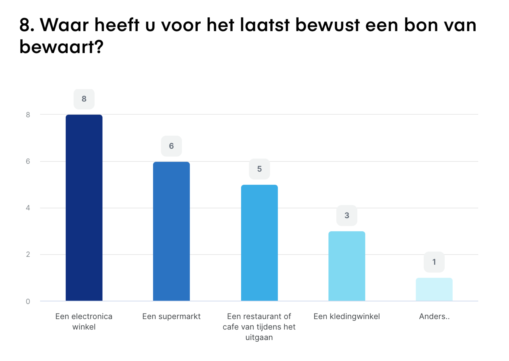
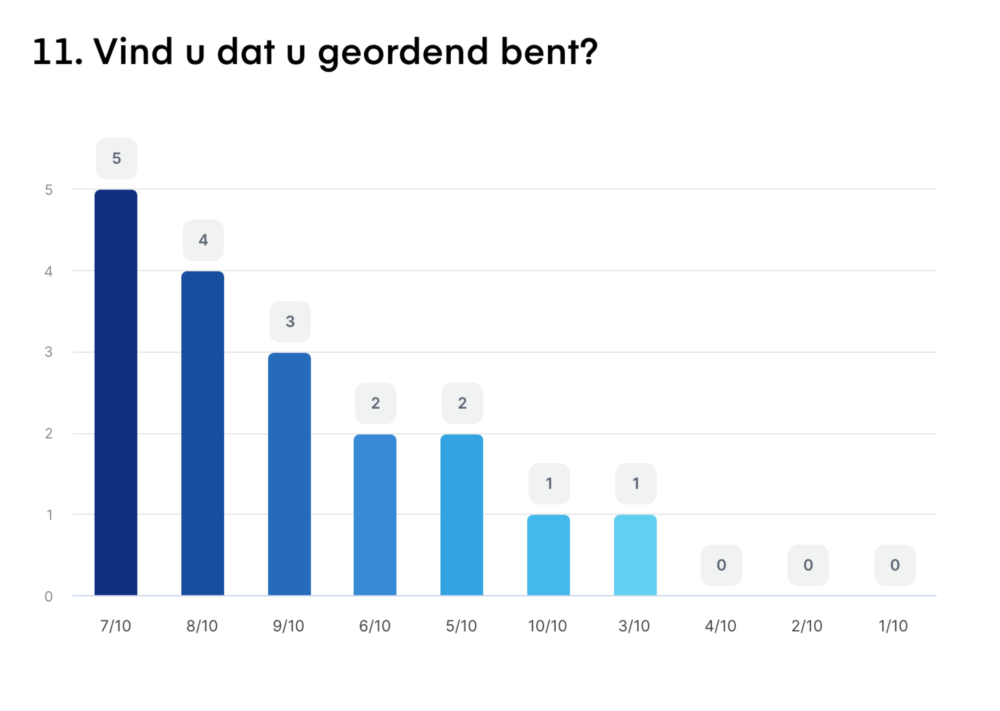

# Survey

Oude survey: [https://www.survio.com/survey/d/A4I9F1E8Q8Y3U3J1D](https://www.survio.com/survey/d/A4I9F1E8Q8Y3U3J1D)\
Nieuwe survey: [https://www.survio.com/survey/d/M3W4X0I5H2Q6W6T3K](https://www.survio.com/survey/d/M3W4X0I5H2Q6W6T3K)\

**Aanpassingen:**\
\- In de eerste vraag stelde ik veel open vragen\
\- Ik heb meer gesloten vragen/multiple choice toegevoegd\
\- Meer ingaan op het gedrag van consumenten\
\- Kiezen welke stukken uit de enquete bijdragen aan het gemak en het milieu\
\- Kijk naar wat aansluit op je deelvragen\
\- Ik heb meer antwoorden verzameld via Facebook\
\- Ik heb de vragen vereenvoudigd\
\
De meeste vragen uit de enquete zijn gesloten vragen. Dat vind ik makkelijker om te analyseren om overeenkomsten te vinden. Daarbij kreeg ik voor de tweede enquete meer invullingen. De volgorde uit de antwoorden lijkt op elkaar, mensen bergen de bon vaak snel op. En gooien het weg of bewaren dit thuis. De manier waarop komt terug uit welke branche zij kopen, of wat voor product het is. Soms verschilt hun reden ook, als zij het niet zeker weten, dan maken zij soms niet de bewuste keuze om de bon te bewaren. \
\
Het is belangrijk voor mij om te begrijpen hoe consumenten denken over het gebruiksgemak en de milieueffecten van kassabonnen. Mijn enquête richt zich op hoe consumenten hun bonnen bewaren, hun gedrag ten opzichte van het milieu, en hoe ik het gebruiksgemak kan verbeteren.\
\
Ik heb de enquête openbaar gedeeld op social media om meer mensen te bereiken. Ik heb 18 antwoorden ontvangen op de enquête. Een groot deel van de respondenten is jong volwassen maar hebben allemaal met hetzelfde probleem te maken. Hierbij heb ik ook suggesties van (verre) concurrende apps gekregen om te bekijken tijdens mijn benchmark

onderzoek. Uit de antwoorden kan ik zien wanneer het gebruiksgemak en duurzaamheid belangrijk zijn. \
\
**Resultaten:**&#x20;

<figure><figcaption></figcaption></figure>

 

<figure><figcaption></figcaption></figure>

 

<figure><figcaption></figcaption></figure>

 

<figure><figcaption></figcaption></figure>

 

<figure><figcaption></figcaption></figure>

 

<figure><figcaption></figcaption></figure>

 

<figure><figcaption></figcaption></figure>

 

<figure><figcaption></figcaption></figure>

 

<figure><figcaption></figcaption></figure>

 

<figure><figcaption></figcaption></figure>

 

<figure><figcaption></figcaption></figure>

 

<figure><figcaption></figcaption></figure>

De meeste surveys zijn zoals verwacht. Ik ben wel op een aantal inzichten gekomen zoals patronen in zorgvuldigheid, en hoe geordend mensen zijn naarmate zij iets willen. Als het belangrijk wordt dan gaan zij heel actief om met hun garantie, bewaren en veiligheid en is bijvoorbeeld het milieu minder belangrijk. Dan wordt hun eigen voorbehoud belangrijker. \
\
Daarnaast vinden consumenten pas belangrijk als zij niet zeker zijn over het product of als het duur is. Daarom is er bij sommige branche's meer reden om de app voor te gebruiken, zoals bij elektronica zaken. Alsnog, ookal is het minder prijzig.\
\

De enquete heb ik eerst verstuurd in een cmd groepschat, zo kreeg ik eventueel nog wat tips, om mijn vragen te versterken en eventuele concurrerende apps te bekijken. Daarna heb ik de enquete openbaar op social media geplaatst en kreeg ik inzichten. Dit beschrijf ik hierna als het een interessant inzicht is. Om de volledige enquete te zien bekijk de (PB).\
\
**Inzicht** \
\
Uit de interviews vertelden consumenten dat zij de bon vaak snel opbergen en thuis bewaren afhankelijk van de prijs. Maar ook dat garantie wat meer voorkomt. Supermarkten zijn onbewust/automatisch, elektronica is met veel meer met opzet. Dit komt overeen met de survey.\
\
Ik kreeg wat meer informatie over hun persoonlijkheid. Ik denk dat de motivatie van de consument veranderd als hun behoeften groter zijn. Daar bedoel ik mee als iets heel duur is dan zijn zij geordend, als de moeite en prijs kleiner is dan denken zij graag mee over het milieu. Als zij iets echt Moeten hebben dan proberen zij de app uit. Als de reden belangrijk 
is dan stijgt de kans op succes van mijn product.

Ik vind het wel verbazend dat consumenten zichzelf wel hoog plaatsen hoe geordend zij denken dat ze zijn. Daar kan ik alleen van aannemen dat hun noodzaak met bonnen vaak niet groot is, tenzij zij het wel willen bewaren (als iets duur is), en zij dan geordend omgaan met hun bonnen.&#x20;

<figure><figcaption>
Survey uit Groenlicht
</figcaption></figure>

Een ander inzicht is het feit dat er 2 miljard bonnen worden verspilt, als ik dit vertel tijdens interviews zijn mensen niet bewust van dit probleem. Terwijl in vraag 6 mensen hier wel bewust van zijn. Alhoewel ik denk dat het product eerder focust op de optimale ervaring met bonnen, en dit het probleem automatisch moet aanpakken, inplaats van andersom.&#x20;

<figure><figcaption>
Survey uit Groenlicht
</figcaption></figure>

Het moet hun aandacht om bonnen efficiënt te bewaren niet weghalen, maar ik denk wel dat er reclame, notificaties en hun informeren over dit feit kan helpen in de app. Ik denk wel na om in de app te experimenteren door consumenten op de feiten te drukken, of een aantal "Wist Je Dat" te gebruiken. Zo maak ik hun toch bewust van het feit dat hun gebruik van de app meehelpt aan een oplossing om minder papier te gebruiken.

<figure><figcaption>
Survey uit Groenlicht
</figcaption></figure>
