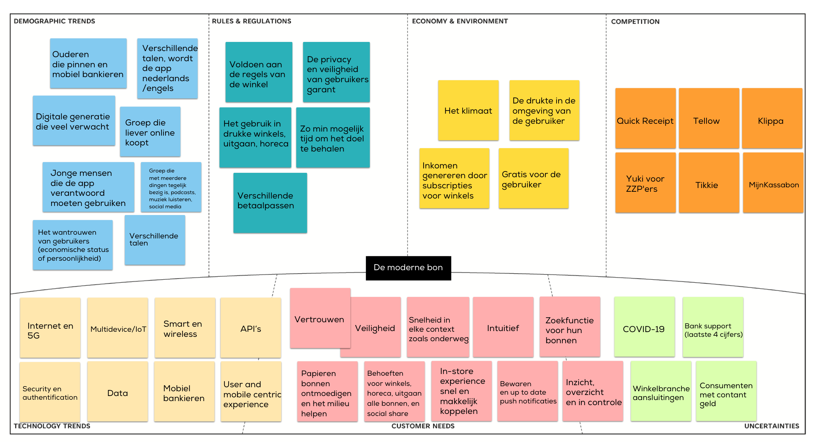

# Context Mapping

**Wat neem ik mee**

* Fysieke omgeving: supermarkt, kledingwinkel, elektronicawinkel,&#x20;
* Sociale omgeving: thuis om de app te installeren, winkelen en andere klanten
* Emotionele toestand: gestrest, gehaast, chaotisch
* Doelstellingen: kassabonnen besparen, speciale aankopen opbergen
* Apparaten en technologie: API, telefoon
* Interactiekanalen: contactloos betalen bij de kassa, mobiele telefoon
* Gedrag: gebruik van de bankpas bij betaling, automatisch
* Voorkeuren: automatisch opslaan van kassabonnen, eenvoudige toegang tot opgeslagen bonnen, makkelijk terugvinden van bonnen, etc.
* Pains: onduidelijke bonnen, verloren bonnen, geen toegang hebben tot opgeslagen bonnen, de kassabon bewaren
* Kansen: integratie met financiële apps, automatische categorisering van bonnen, automatisch kassabonnen ontvangen

<figure><figcaption>
Context map v1
</figcaption></figure>

Ik wil de trends en behoeften in deze context meenemen om ervoor te zorgen dat mijn app uniek is, om na te denken in welke context de doelgroep dit gebruikt. Ik heb het idee om een API gebruiken in een winkel context. Het moet sneller, en handiger werken dan de kassabon. Mijn app werkt automatisch door kassabonnen tijdens het betalen op te slaan, wat anders is dan bijvoorbeeld Quick Receipt of Klippa, ik heb namelijk tijdens het Benchmarken gezien dat deze apps handmatig zijn. Dat maakt de kassabon bewaren niet makkelijker. Een ander idee is om kosten te splitten met de kassabon, iets wat Tikkie nog niet doet.

Ik vergelijk de behoeften om te bedenken hoe de doelgroep de app wil gebruiken in een specifieke context. Bijvoorbeeld, de snelheid die consumenten in een winkel verwachten moet samengaan met een door de interactie intuïtief te maken.&#x20;
