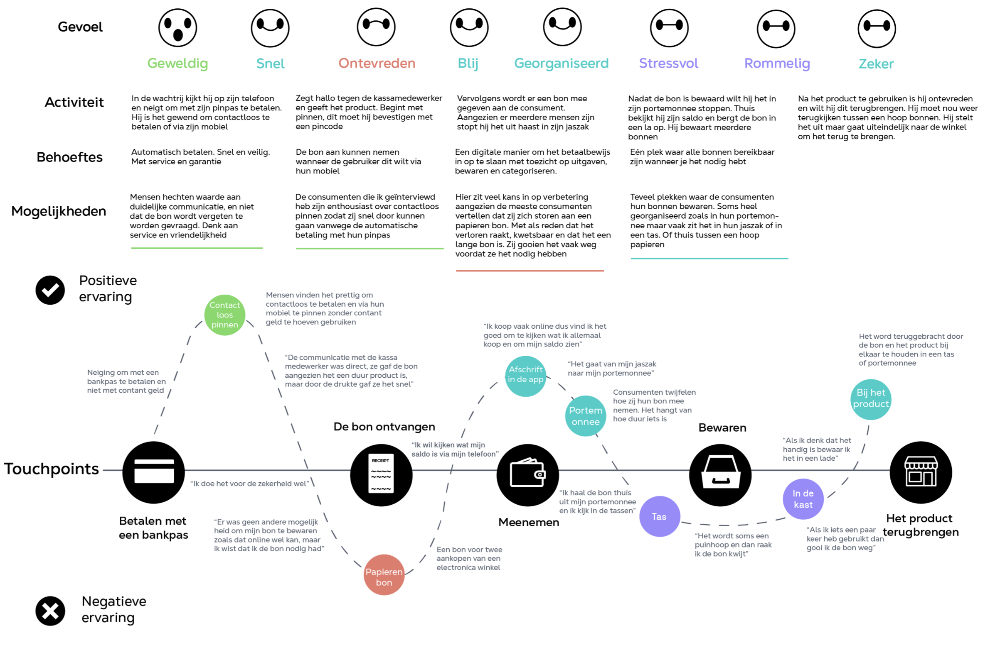

# Customer Journey ervaring

**Wat neem ik mee**

* Contactloos pinnen wordt goed ervaren, dit kan ik gebruiken voor mijn concept
* Omdat mensen pinnen met hun pas, kan ik hun ervaring uitbreiden met een digitale bon terwijl zij pinnen
* De doelgroep is ontevreden tijdens het krijgen van een papieren kassabon&#x20;
* De doelgroep bewaart de bon op verschillende manieren
* De meeste geïnterviewden raken hun bon kwijt of gooien het direct weg&#x20;
* De doelgroep vindt de bon onhandig omdat niemand papier wilt bewaren, een digitale opslag zou veel beter zijn

<figure><figcaption>
Customer Journey v1
</figcaption></figure>

**Wat heb ik gedaan**\
\
Ik heb de customer journey gemaakt op basis van de inzichten van de doelgroep, ik heb vervolgens gekeken heb naar alle touchpoints en mogelijke problemen. Het viel mij op dat de ervaringen zoals contactloos pinnen positief zijn, en een papieren kassabon negatief wordt ervaren, het is onhandig om op te bergen.

In de customer journey heb ik alle momenten van de consument opgenomen, vanaf het moment van betaling tot aan het eventueel bewaren en terugbrengen van de bon thuis. Of dat zij dit direct weggooien om ervan af te zijn., het hangt af van hun behoeften. Echter, het feit dat de papieren bon zo negatief wordt ervaren, is een belangrijk inzicht om hier iets voor te bedenken. Dit touchpoint kan verbeterd worden omdat het slecht is voor het milieu en slecht werkt volgens de gebruiker.&#x20;
