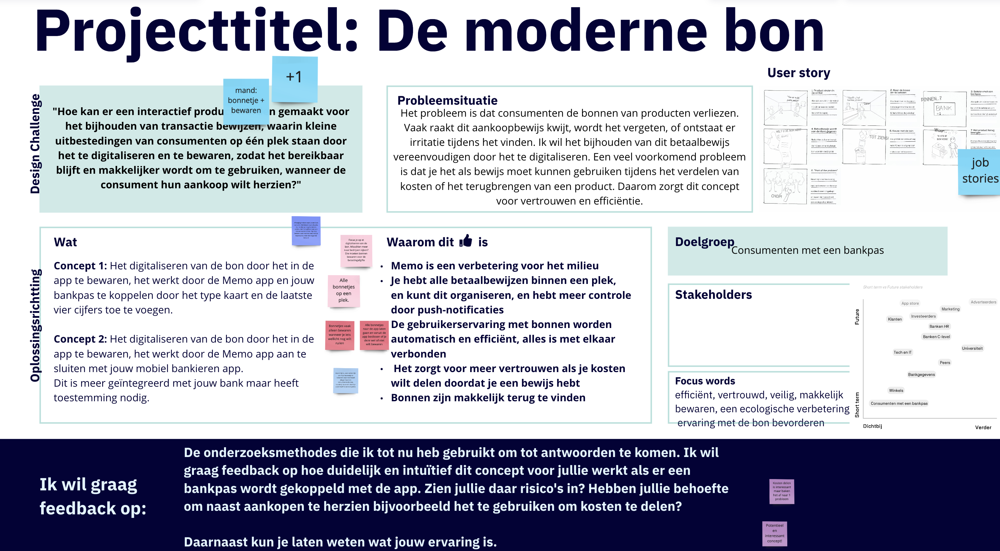
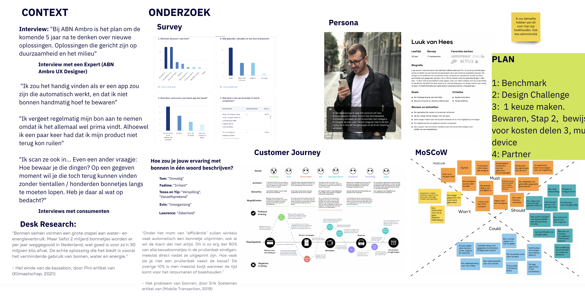

# Feedback Frenzy

**Wat neem ik mee**

* Hou het kort, mand
* Ik houd de functies kleiner door gesprekken te voeren met de doelgroep
* Denk na over het probleem!
* De Design Challenge heb ik aangepast
* Het milieu komt hierna veel meer navoren
* De uitdaging gebruiksgemak en milieuoplossing staan nu voorop
* Maak Job Stories
* Ik heb hierna één duidelijke functie dat het probleem aanpakt
* Kies één belanghebbende om voor te testen

Tijdens het project kreeg ik halverwege een klassikale Feedback Frenzy op miro. De feedback die ik kreeg was nuttig om de scope van het project te verkleinen. Ik had te veel ideeën en inzichten die ik wilde gebruiken, en dat leidde tot een te brede focus tijdens de presentatie. Ik heb dit aangepakt door de app klein en duidelijk te houden. Er is nu een feature die om het echte probleem aan te pakken. Dit kan ik verwerkelijken door het milieuprobleem en gebruikersprobleem op te lossen met een cconcept, en mij te richten op de werking. Dit doe ik door dichtbij de doelgroep te staan.&#x20;

<figure><figcaption>
Eerste helft van de feedback
</figcaption></figure>

Het is voor mij de uitdaging om de design challenge nog concreter te maken. Maak dit pakkend en laat het probleem naar voren komen. De design challenge was te lang. Nu heb ik het veel kleiner gemaakt. Daarnaast ben ik direct met Job Stories begonnen. Dit licht ik toe in ideeën genereren&#x20;


Hoe kan een interactief product bonnen digitaal bewaren, waarbij consumenten met een bankpas dit betaalbewijs efficiënter kunnen gebruiken als zij hun aankoop willen herzien?


De rest van de feedback bleek positief, peers hadden behoefte aan dit concept. Maar wel op de juiste manier, niet teveel moeite en op een plek bewaren.&#x20;

<figure><figcaption>
Tweede helft van de feedback
</figcaption></figure>

Ik heb na de Feedback frenzy een plan gemaakt om de interactie van mijn app te doorgronden, dat zie je in de groene note. De overige feedback van mijn methodes kwam vooral van de docenten die namelijk hun administratie als zzp'er bij willen houden. Ik denk dat dit buiten de scope van mijn project valt. Ik wil alleen de werking van kassabonnen moderniseren.&#x20;
