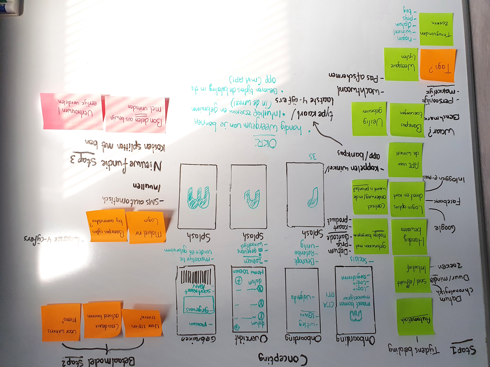

# Brainstormen

<figure><figcaption>
OKR's
</figcaption></figure>

* Handig bonnen tonen en kunnen gebruiken
* Intuïtief en snel bonnen zoeken
* Automatisch bewaren tijdens je betaling in de app

• _Wat is het probleem of de behoefte die we willen oplossen?_ \
\
_• Wat moet de applicatie doen?_ \
\
_• Wat is de zakelijke kans? (bijv. acquisitie, activering, retentie, omzet, doorverwijzing, enz.)_ \
\
_• Wat zijn de Key Performance Indicators (KPI's)?_ \
\
_• Hoe zullen we anders het succes van dit project definiëren?_ \
\
_• Wie zijn de gebruikers of klanten?_ \
\
_• Waarom is dit belangrijk voor hen?_ \
\
• _Waarom geven zij erom?_ \
\
_• Wat proberen de gebruikers te doen?_ \
\
_• Wat zijn hun pijnpunten?_ \
\
_• Hoe kunnen we de gebruikers bereiken via dit ontwerpproces?_ \
\
_• Zijn er beperkingen (technologisch, zakelijk, enz.)?_ \
\
_• Hoe is dit beter of onderscheidend van concurrenten?_ \
\
_• Zijn er relevante producten waar we naar kunnen kijken?_ \
\
• _Wie zijn de belangrijkste beslissers over dit project?_ \
\
_• Bestaan er merkrichtlijnen? Bestaat er een stijlgids?_

