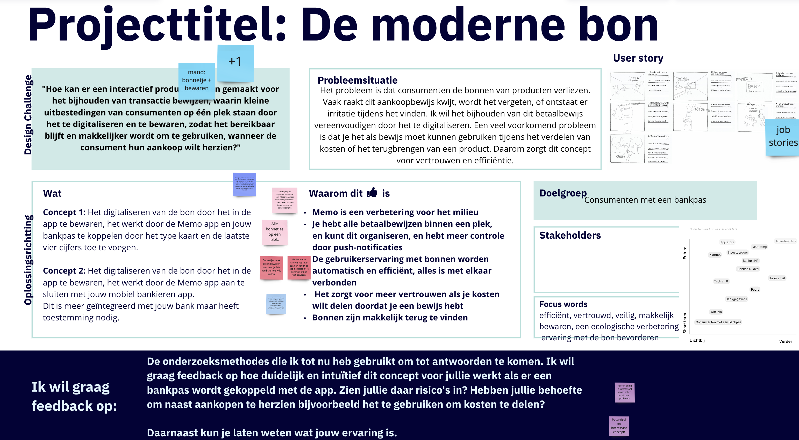

# Feedback Frenzy

De feedback frenzy kwam halverwege het project. Deze sessie hielden wij klassikaal en op Miro. Ik kreeg een hoop interessant feedback punten, het meeste over om de scope van het project klein te houden. Aangezien ik teveel inzichten en ideeën wou gebruiken. Houd de app voor wat het moet doen en voor wie dit dan moet zijn. Daar heb ik hierna rekening mee gehouden. De scope van mijn features zijn nu heel klein, stakeholders haalbaar en de doelgroep is een op een met de consument. Ook zodat ik dichtbij hen sta om voor te testen. Dit is de sessie geworden.&#x20;

<figure><figcaption>
Eerste helft van de feedback
</figcaption></figure>

Om alles hier samen te vatten, het is voor mij de uitdaging om de design challenge beter over te communiceren, ook tijdens mijn presentatie. Maak dit pakkend en laat het probleem naar voren komen. De design challenge is te lang, het is een oud voorbeeld dat ik teveel rekening wou houden met alle behoeften van de doelgroep. Vandaar, mand. Nu heb ik het veel kleiner gemaakt. Daarnaast ben ik direct met Job Stories begonnen die je in de ideation fase kunt lezen.&#x20;


Hoe kan een interactief product bonnen digitaal bewaren, waarbij consumenten met een bankpas dit betaalbewijs efficiënter kunnen gebruiken als zij hun aankoop willen herzien?


De rest van de feedback bleek positief, peers hadden behoefte aan dit concept. Maar wel op de juiste manier, niet teveel moeite en op een plek bewaren.&#x20;

<figure><figcaption>
Tweede helft van de feedback
</figcaption></figure>

Ik heb na de feedback frenzy een plan gemaakt om de interactie van mijn app te doorgronden, dat zie je in de groene note. De overige feedback van mijn methodes kwam vooral van de docenten die namelijk hun administratie als zzp'er bij willen houden. Ik denk dat dit buiten de scope van mijn project valt maar wel iets is om later rekening mee te houden.&#x20;
