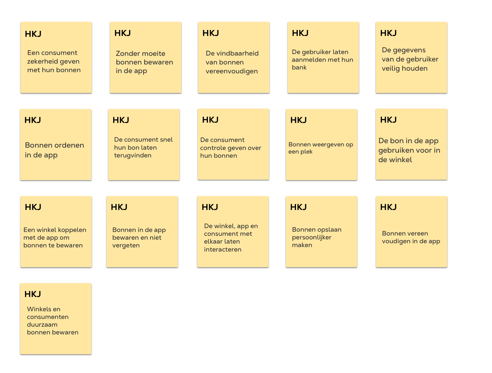
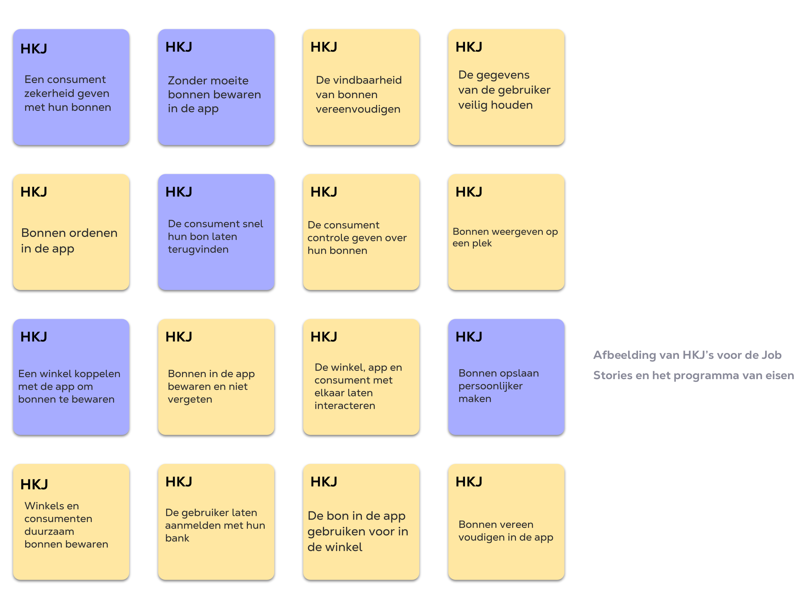

# HKJ's

**Wat heb ik gedaan**\
\
Ik gebruik de "How might we" methode om ideeën te genereren voor de uitdaging van mijn project. Op basis van inzichten uit het onderzoek, groepeer ik deze behoeften in "Hoe kun je's" om oplossingen te bedenken voor het milieu en het gebruiksgemak. Tijdens het brainstormen ben ik op deze ideeën gekomen voor mijn concept. Ik combineer deze methode met Job Stories om de behoeften en taken van de doelgroep concreet te maken.

**Aanpassingen**

* Meer hoe kun je's over duurzaamheid
* De gebruiker motiveren om een steentje bij te dragen toegevoegd
* De werking duidelijk maken toegevoegd
* Ik heb Hoe kun je's gekozen
* Ik heb de Hoe kun je's in de Design rationale duidelijker gemaakt

<figure><figcaption>
HKJ's v1 (ongeselecteerd)
</figcaption></figure>

Alle behoeften uit de Discovery fase en MoSCoW heb ik gegroepeerd in “Hoe Kun Je’s”om tot ideeën en concepten te komen. Tijdens een groepsessie en het brainstormen kwam ik uit op deze ideeën als uitgangspunt van mijn app.

<figure><figcaption>
Hoe kun je's uit Groenlicht
</figcaption></figure>
