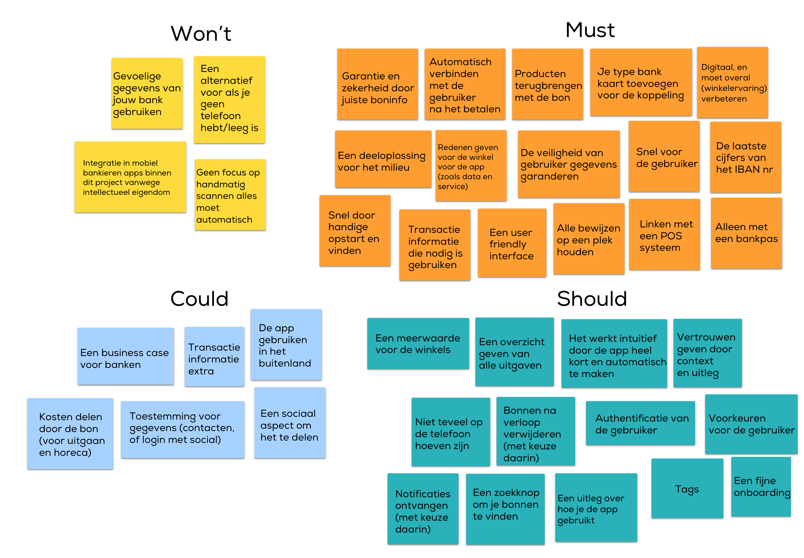

# MoSCoW

<figure><figcaption>
MoSCoW v1
</figcaption></figure>

\
Op basis van de behoeften van de consument kan ik dit verwerken in wat het product nodig heeft en wat ik kan uitschakelen. Dit zijn alle features die het product nodig heeft om bonnen aangenaam te bewaren. \
