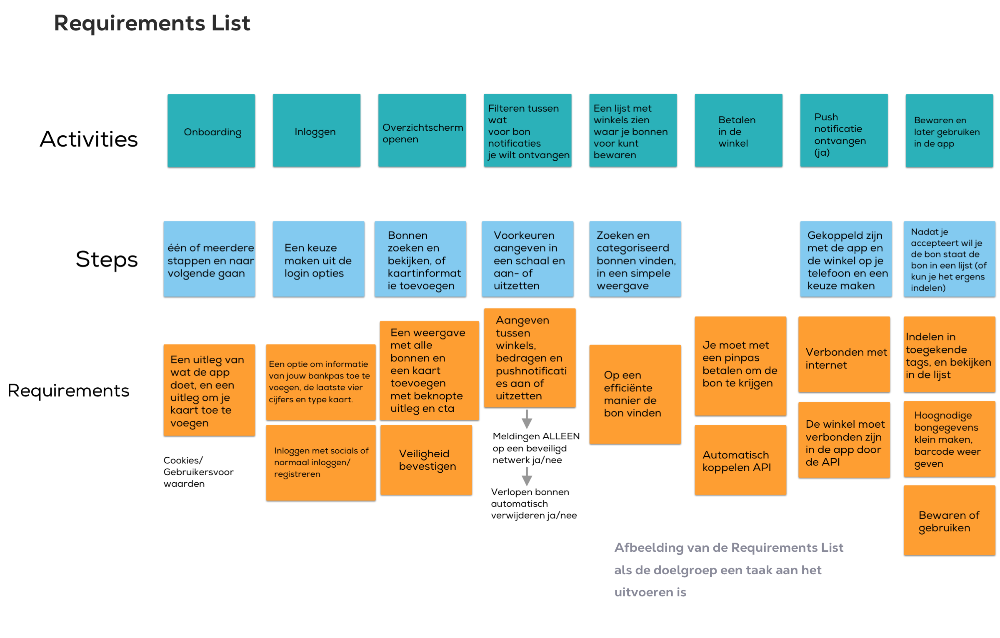

# Programma van Eisen

**Aanpassingen**

Ik heb tijdens de iteraties gekeken naar de eisen per belanghebbende voor het programma van eisen. Dit maakt het makkelijker om per groep te zien waar het concept aan moet voldoen. In het nieuwe programma van eisen heb ik nagedacht over hoe het prototype succesvol kan zijn. Dit zijn verwachtingen van de gebruiker, winkels en technische eisen. Dit werkte voor mij ook veel makkelijker omdat ik dit gebruik voor mijn prototype.

**Wat neem ik mee**

* Alle eisen per belanghebbende zijn nu inzichtelijk
* Ik heb aanpassingen gemaakt op basis van meer tests en onderzoek
* De uitdaging/oplossing hebben meer focus op gebruiksgemak en het milieu

**Eisen van het product:**\
\
• Het product kan automatisch werken

• Het product is moeiteloos

• Het product is milieuvriendelijk

• Het product is interactief

• Het product is een app (prototype)

• Het product is gebruiksvriendelijk en voldoet aan hun behoeften.

• Het product is makkelijk om te begrijpen

• Het product is veilig en betrouwbaar&#x20;

**Eisen van de gebruiker**

• Het moet milieuvriendelijk zijn

• Het moet moeiteloos en automatisch zijn&#x20;

• Het moet handig zijn&#x20;

• Het product heeft een overzichtelijke weergave met kassabonnen

• Het heeft gemakkelijke zoekfuncties

• Het moet veilig zijn

• Het liefst een groot winkel aanbod

**Visuele wensen van het product**

• De visuele stijl versterkt de werking van het prototype

• Het prototype ziet er betrouwbaar uit

• De visuele stijl is zakelijk en vriendelijk

• Duidelijke en intuïtieve navigatie om gebruikers snel op weg te helpen

• Het interface is functioneel in de context in een winkel of een snelle gebruiker

**Eisen van de winkel**

• Het product versnelt wachtrijen

• Het product is milieuvriendelijk

• Het product biedt een goede service

• Het product is makkelijk om te verbinden met hun kassasysteem

**Technische eisen van het product**

• Het product maakt gebruik van een API om verbinding te maken met zowel de winkel als de gebruiker

• Het product wordt verbonden met behulp van een bankpas van de gebruiker

• Het product werkt automatisch

• Het product is veilig en werkt betrouwbaar

• Het product is interactief

• Het product werkt snel

**Eisen voor de bank in de toekomst**

• Het product is getest&#x20;

• Het product kan geïntegreerd worden&#x20;

<figure><figcaption>
Requirements List v1
</figcaption></figure>

<figure><figcaption>
Requirements List Groenlicht
</figcaption></figure>
