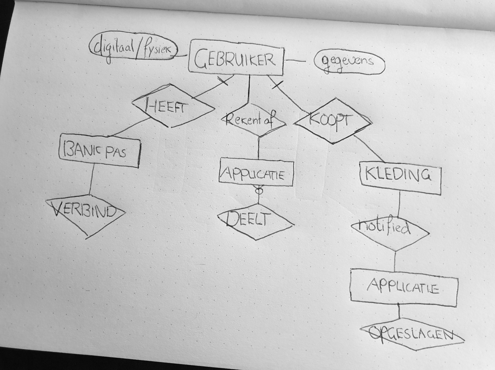

# Sketching

**Wat heb ik nodig**

Omdat ik veel ideeën had om kassabonnen digitaal te maken, heb ik deze opgeschreven en later omgezet in een concreet concept tijdens de conceptualisering fase. Tijdens het schetsen heb ik geïnventariseerd welke personen en hulpmiddelen nodig zijn, zoals de doelgroep, winkels, pinpas milieu en een kassabon. Ook dacht ik na over wie niet direct betrokken zijn zoals banken en concurrenten, maar wel belangrijk zijn voor een samenwerking of om inspiratie op te doen. (ABN Ambro/Tikkie).\
\
**Brainstormen**

Ik heb de informatie op kassabonnen onderzocht en zo ontdekte ik dat er een verbinding kan worden gemaakt tussen gebruikers die een bon ontvangen, de winkel die de bon stuurt en de bankpas die wordt gebruikt bij het POS-systeem. Door deze interacties samen te laten werken, kan er een connectie worden gemaakt. In mijn concept licht ik dit verder toe.&#x20;

**Wat neem ik mee**

* De doelgroep moet met een bankpas betalen om de app te gebruiken
* De gebruiker kan zich aanmelden met deze bankpas
* Alle gegevens op de kassabon moeten hetzelfde zijn als in de app
* De gegevens op de kassabon kunnen bruikbaar zijn voor in de app, ik zag dat een deel van de IBAN op de bon staat
* De winkel gebruikt een POS systeem
* De kassabon digitaal ontvangen moet even snel zijn als papieren kassabonnen om een impact te maken
* De kassabon digitaal bewaren kan wel sterk verbeterd worden
* Ik ben aan het nadenken over het automatisch ontvangen van kassabonnen of via een melding. Wanneer dit automatisch gebeurt, hoeft de gebruiker geen moeite te doen om de meldingen te accepteren, en dus de positieve impact op het milieu groter wordt. Het is wel belangrijk dat de gebruiker dit kan instellen.
* Aangezien het aantal mensen dat contactloos betaalt steeds groter wordt, zou de digitale bon hierop kunnen inspelen.

<figure><figcaption>
Sketch v1
</figcaption></figure>

<figure><figcaption>
Sketch v2
</figcaption></figure>

<figure><figcaption>
Sketch v3
</figcaption></figure>
