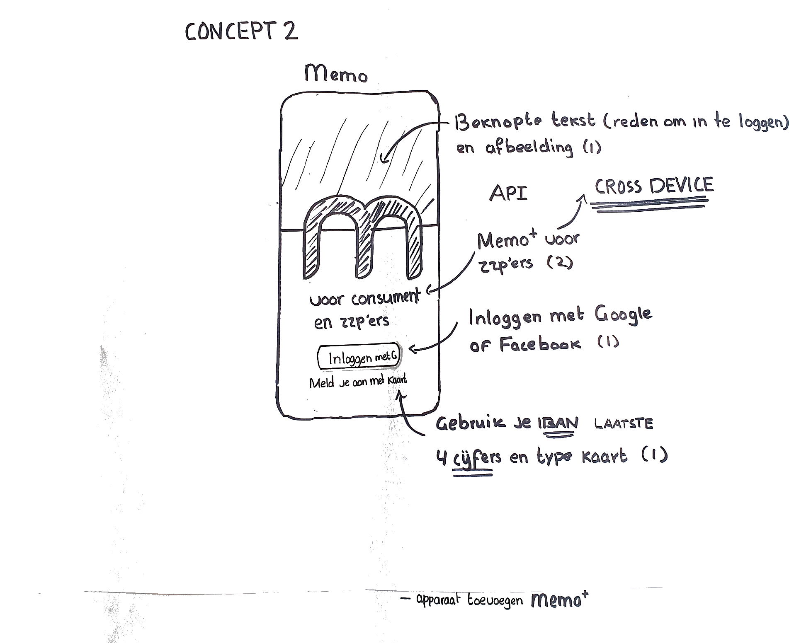
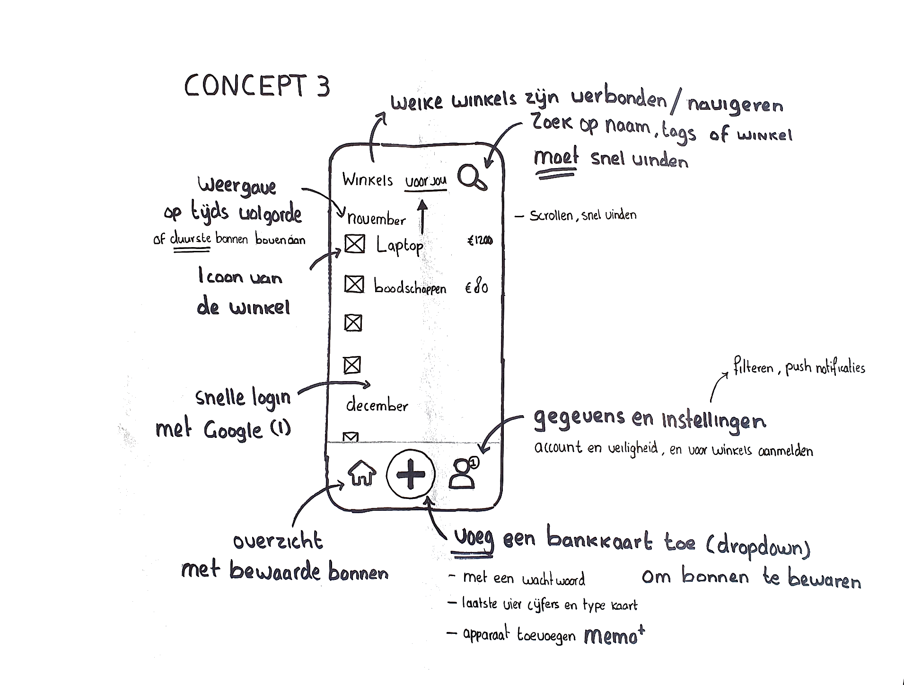

# Concept

<figure><figcaption>
Concept 1
</figcaption></figure>

\
Dit zijn de features/concepten van mijn app, ik ging nadenken hoe een app als deze eruit kan zien.\
Met daarin hoe bonnen worden getoond. Waar je snel kunt zoeken en via dit overzicht een deel van je bankkaart toevoegt of mee moet aanmelden.

Ik vind het interessant om na te denken over waar de kans op succes ligt, en volgens mijn onderzoek is dit natuurlijk de snelheid, veiligheid en dat de verwachting automatisch is, maar de extra’s zoals cross device administratie met bonnen bijhouden vind ik ook interessant. \
\
Aangezien het idee al vroeg duidelijk was om een app te ontwikkelen, aangezien het complex is, heb ik ervoor gekozen om concepten te maken op basis van features. Denk aan bonnen bewaren en gebruiken, en waar je jouw gegevens kunt beveiligen, en hoe ik de api kan bewerkstelligen, dat is een manier om te winkel, consument/bank met elkaar te laten communiceren. Dit stuurt data naar elkaar toe, bijvoorbeeld als jij dit doet (een IBAN toevoegen) dan krijg je dit terug uit het systeem (de bon uit de winkel) omdat het beiden met de app is verbonden. Een api is een contract die ervoor zorgt dat dit idee werkt.&#x20;

<figure><figcaption>
Concept 2
</figcaption></figure>

<figure><figcaption>
Concept 3
</figcaption></figure>
