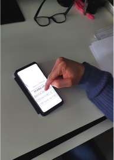
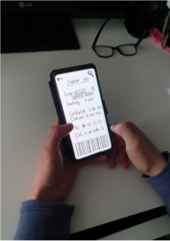
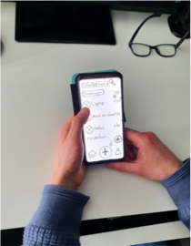
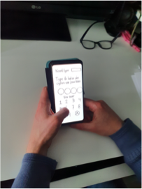
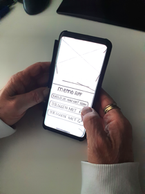
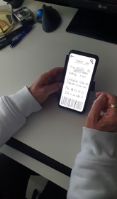
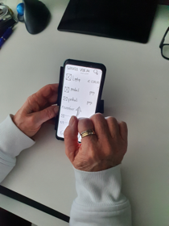
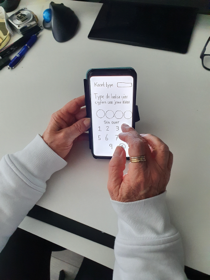

# Proof of Concept

**Wat heb ik gedaan?**


Voor mijn eerste proof of concepts heb ik een paar mensen gevraagd om mijn Lo-Fi prototype te testen. Omdat het prototype nog in de begin fase zit, wil ik de gebruiker goed analyseren voordat ik het uitwerk. Ik geef hun soms specifieke taken om op te focussen (PB). Zoals ‘meld je aan en kom erachter hoe je digitale kassabonnen ontvangt’. Ik vind het belangrijk om het concept/functionaliteit eerst te valideren. Ik test het Hi-Fi prototype in een drukke omgeving om te kijken of het in de echte wereld past.

**Taken**

* Meld je aan in de app&#x20;
* Krijg een indruk van hoe je een aankoopbon ontvangt
* Zoek een bon via een van de zoekopties
* Open en gebruik een bon voor je garantiebewijs
* Bekijk het winkel aanbod van de app
* Krijg een indruk van de instellingen en tags om sneller een bon te vinden
* Wissel van omgeving om je andere bonnen te zien

## User Testing 

Hier valideer ik mijn concept door te kijken hoe ik de ervaring kan verbeteren, en aannames kan voorkomen. Ik wil zien hoe gebruikers met mijn prototype omgaan. Dit doe ik om kwalitatieve feedback en antwoorden te verzamelen. Ik gebruik daarom deze vragen om het prototype te testen. Ik heb eerst een paar gebruikers getest en na de test \
\

<figure><figcaption>
Eerste test
</figcaption></figure>

<figure><figcaption></figcaption></figure>

<figure><figcaption>
Derde test
</figcaption></figure>

<figure><figcaption>
Vierde test
</figcaption></figure>

## **Observeren**

**Proof of concept Test 1**&#x20;

<figure><figcaption></figcaption></figure>

 

<figure><figcaption></figcaption></figure>

 

<figure><figcaption></figcaption></figure>

 

<figure><figcaption></figcaption></figure>

**Test 1 met Liam**\
Tijdens de test heb ik eerst mijn concept toegelicht. De onboarding van de gebruiker ging met complicaties. De gebruiker gaf aan dat er veel opties waren en dat hij niet begreep waarom hij een bankpas moest gebruiken zonder uitleg. Het invoeren van de 4 IBAN cijfers verliep echter snel. "Dit vind ik wel makkelijk om mee aan te melden, ik denk dat het veilig is," zei hij.

Op het overzichtsscherm zag de gebruiker een aantal digitale bonnen als default state. Dit werkt dus goed. Hij dacht dat dit zijn kassabonnen van de winkel zijn. Als hij iets moest vinden, gebruikte hij de zoekknop. Hij zou zoeken op product, prijs, winkel,  datum. Hij had verwacht dat hij zijn instellingen kon aanpassen door op het gebruikersicoon te klikken. Hij zou hier graag de bedragen aanpassen voor zijn kassabonnen, omdat hij niet veel bonnen wilt ontvangen. De app vind hij een goed idee voor het milieu.\
\
**Proof of concept Test 2**

<figure><figcaption></figcaption></figure>

 

<figure><figcaption></figcaption></figure>

 

<figure><figcaption></figcaption></figure>

 

<figure><figcaption></figcaption></figure>

**Test 2 met Jolande**
\
De resultaten uit de tweede test waren vergelijkbaar: er was behoefte aan meer uitleg in de app. De gebruiker vond het idee belangrijk als consument en om het milieu te helpen. Tijdens de test kwamen inzichten naar voren over het aanpassen van instellingen en het aangeven waarvoor ze kassabonnen kan bewaren. Tijdens de test heeft de gebruiker geprobeerd om in te loggen via social media en om later een bankpas toe te voegen. Uit de testresultaten, en gesprekken met de doelgroep en medestudenten bleek dat dit ingewikkeld was omdat het beter zou zijn om de optie om alleen via een bankpas in te loggen aan te bieden. Mijn keuze is om dit kort te houden zodat de functie van de app duidelijker wordt en ik meer uitleg kan geven in de app.

**Wat neem ik mee**\
\
• Het concept werd door de gebruikers  positief ontvangen,&#x20;

• Het zoeken van een bon ging makkelijk, ook als zij de bon niet nodig hebben, willen zij een steentje bijdragen aan het milieu

• Uit testen en gesprekken kwam naar voren om de app kort te houden en te focussen op de functionaliteit

• De testpersonen vinden het milieu en hun gebruiksgemak belangrijk, daarom kan ik tekst en iconen gebruiken.

• “Doordat ik weinig moeite hoef te doen is het een goede verbetering voor kassabonnen”

• “De interactie van de app is gemakkelijk en daarom zou ik het gebrruiken alleen meer voor het milieu”.&#x20;
