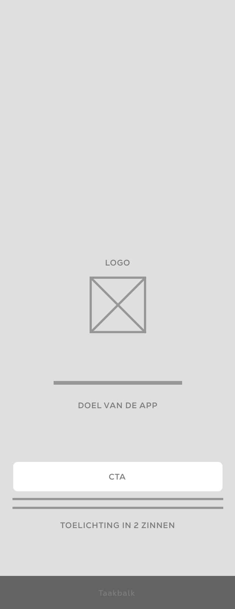
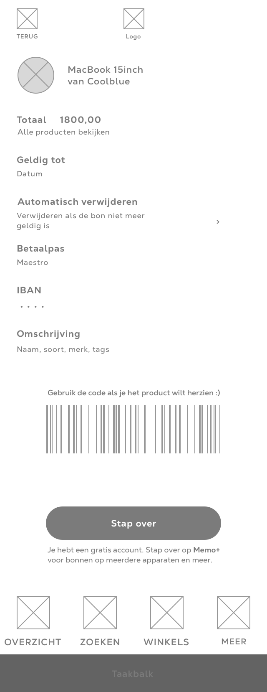

# Wireframes

<figure><figcaption>
Splash screen
</figcaption></figure>

 

<figure><figcaption>
Aanmelden
</figcaption></figure>

 

<figure><figcaption>
Overzicht
</figcaption></figure>

 

<figure><figcaption>
Introductie
</figcaption></figure>

**Splash screen**

Het Splash scherm heb ik gemaakt op basis van benchmarken hoe ik gebruikers kan activeren. Ik merk dat een korte laad animatie gebruikers activeert. Het is een korte introductie van mijn app en stuurt je naar de aanmeld knop.


Het scherm moet kort zijn, een paar seconden maximaal&#x20;



Het is effectief


**Introductie**

Het introductie scherm is een inleiding om je met jouw IBAN aan te melden, en te vertellen wat de app doet. En vervolgens druk je op beginnen.&#x20;


Denk na over de tone of voice, ik denk dat deze eenmalige aanmelding met de laatse vier cijfers van je IBAN heel intuïtief is


**Aanmelden**\
\
Het aanmeld scherm moet beknopt zijn, en duidelijk. Met een rede waarom ik om de IBAN vraag, waarbij ik hun vertrouwen kan krijgen door maar een deel te vragen en een voorbeeld geven hoe de code er uit ziet (en waar je het kunt lezen). Dat lijkt mij prettig, want er is geen lange onboarding nodig.&#x20;


Tijdens het aanmelden moet de gebruiker zijn aandacht erbij houden, maak het kort



Hele korte stappen werken goed, inplaats van een login, om vervolgens je kaart toe te moeten voegen


**Overzicht**\
\
Het home scherm werkt eigenlijk zoals je zou verwachten, je ziet een indeling van je bonnen, waar je dit bewaart, hoe je tags gebruikt en overzicht houd en kunt scrollen. Alleen de menu items moet ik meer over nadenken, en testen, wat verwachten gebruikers?

<figure><figcaption></figcaption></figure>

\
**Detailscherm**\
\
Het detailscherm, de bon gebruiken lijkt op een standaard bon, alleen ik heb gekeken welke gegevens worden gebruikt, en dit ingekort, en je vaak alleen de barcode wilt scannen. Dit staat er groter op, zodat je het snel in de winkel kunt gebruiken. Ook staan er resterende gegevens van jouw afgeschermde bankkaart, zodat je kunt kijken op welke kaart je het geld terugkrijgt.&#x20;


Mijn idee is of, de barcode misschien gelijk op het overzichtsscherm kan worden gebruikt? Zonder de bon te moeten openen. Voor de rest is de gewenning zoals een bon hetzelfde, alleen heb je het dit nu automatisch bewaart.&#x20;

