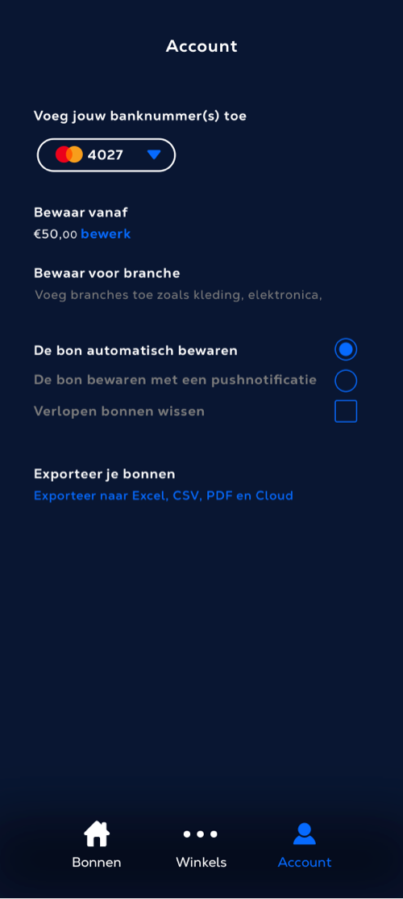
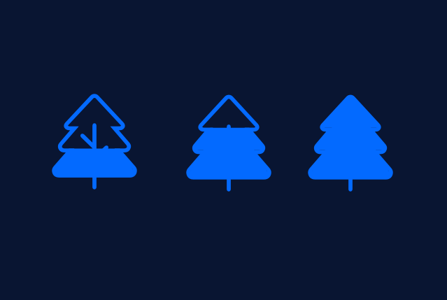

# Hi-Fi Iteratie 2

**Ontwikkelingen**

**Hoe kun je**

Ik heb een "Hoe kun je" gebruikt tijdens de iteratie, om aan te geven wat belangrijk is voor deze ontwikkeling: Hoe kun je **"**Ervoor zorgen dat 
de doelgroep de app gebruikt".

**Concrete inzichten**

* &#x20;Ik heb mijn aandacht gericht op het automatisch opslaan van kassabonnen, wat het concept om het milieu te verbeteren nog sterker maakt
* Ik heb de gebruikersprincipes van Joshua Porter en Stephen Anderson meer gebruikt, deze principes gaan over een moeiteloze ervaring, korte stappen, voldoende uitleg en feedback aan de gebruiker, om de motivatie van de gebruiker te verhogen. Dit zie je aan de tone of voice en korte stappen in de iteratie.
* Ik heb de motivatie van de gebruiker verder verhoogd door meer feedback te geven over hoe zij een steentje bijdragen aan het milieu. Dit doe ik door succes states/feedback 'Nu draag je een steentje bij' 'Gelukt! Je kunt nu automatisch kassabonnen bewaren'
* Om dit te versterken, heb ik de gebruikersinterface verbeterd door knoppen en tekst groter te maken en te verhelderen
* De principes zijn een belangrijke toevoeging voor het gebruiksgemak\

&#x20;**Aanpassingen**\
\
• Tekst in de ‘onboarding’ en ‘winkels’ zijn duidelijker

&#x20;• Meer feedback aan de de gebruiker met states, highlights en iconen  als zij de kassabon gebruiken

&#x20;• Ik heb alles wat groter gemaakt

&#x20;• Mogelijkheid om producten open te klappen\
via de dropdown

&#x20;• Als je een kassabon in de app gebruikt krijg je feedback (blauwe hoeken en succes icoon)

**Welke verbeteringen heeft de app gemaakt?**&#x20;

Dit zijn de verbeteringen in de app. De app is compleet en geeft visuele feedback en uitleg aan de gebruiker. Zij krijgen een duidelijke onboarding met de het doel van de app en hoe zij hun voordeel kunnen doen met automatisch kassabonnen bewaren. De zoekknop is nu vervangen met een formulier om direct te zoeken. Alle stappen zijn nu in één klik en makkelijk voor nieuwe gebruikers.

**• Iteratie Aanmelden**

Het aanmelden heeft andere tekst en design/ux principes zoals content groeperen en de gebruiker helpen

**• Iteratie in de app**

In het account en detailscherm is er meer visuele hierarchy. De gebruiker kan de digitale bon makkelijker inzien door het open te klappen. In het account kan de gebruiker meer personaliseren/filteren welke kassabonnen zij willen ontvangen. Je kunt meerdere pasjes tegelijk gebruiken.&#x20;

**• Iteratie Feedback**

De gebruiker krijgt nu feedback als zij iets hebben voltooid ‘Succes state’. Als je de digitale bon gebruikt krijg je visuele feedback met een ‘Loading state’. Ook heeft de gebruiker meer mogelijkheden om de bon en de instellingen aan te passen.&#x20;

<figure><figcaption>
Hi-Fi Iteratie Flow 2
</figcaption></figure>

**Hi-Fi Iteraties**

.png>)

.png>)

**States**

