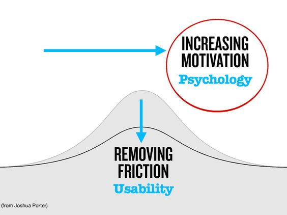
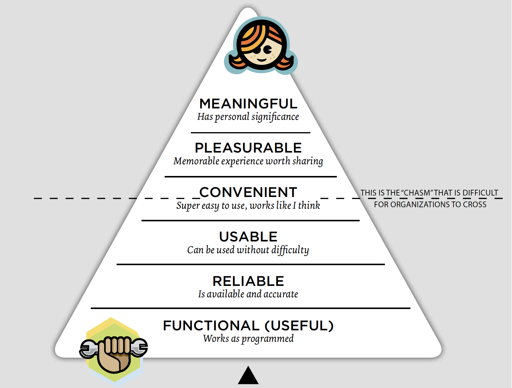

# Design en gebruiker principes

1. **Beyond Usability Increasing motivation en Removing friction**&#x20;

Aangezien mijn focus op de ervaring van de gebruiker ligt en de verbetering voor het milieu moet ik nadenken over hoe ik de motivatie van mijn doelgroep kan maximaliseren. Ik moet de doelgroep ervan overtuigen dat hun behoefte eenvoudig kan worden gemaakt met de app. En dat zij een steentje aan het milieu bij kunnen dragen. Daarom vind ik dit een belangrijke methode om voor mijn prototype toe te passen om hun ervaring en motivatie te verhogen.

<figure><figcaption>
Het model van Joshua Porter
</figcaption></figure>

Joshua Porter is een user experience designer die heeft geschreven over de rol van frictie en motivatie in een ontwerp. Zijn model stelt dat frictie en motivatie twee belangrijke factoren zijn die het gedrag beïnvloeden, en dat ontwerpers deze factoren kunnen gebruiken om gebruikers te beïnvloeden hoe zij met hun producten of diensten omgaan.

Wrijving, volgens Porter, verwijst naar elk obstakel of elke moeilijkheid die een gebruiker kan tegenkomen wanneer hij een taak probeert uit te voeren of een doel probeert te bereiken. Wrijving kan gaan over verwarrende navigatie, trage laadtijden of ingewikkelde stappen. Wanneer gebruikers frictie ervaren, kunnen zij gefrustreerd raken of hun taak helemaal opgeven. In mijn geval de app sluiten.

Motivatie verwijst naar de interne drang van gebruikers om een taak uit te voeren of een doel te bereiken. Motivatie kan zijn het verlangen om tijd of geld te besparen, een behoefte om ergens aan mee te doen of een gevoel van voldoening. Wanneer gebruikers gemotiveerd zijn, is de kans groter dat zij volhouden ondanks wrijving en hun doel bereiken.

Het model van Porter stelt dat ontwerpers moeten streven naar minder wrijving en meer motivatie voor een betere gebruikerservaring. Dit kan worden bereikt door interfaces te vereenvoudigen, duidelijke en beknopte instructies te geven en de ervaring prettig te maken. Door wrijving te minimaliseren en motivatie te maximaliseren, kunnen ontwerpers gebruikers aanmoedigen om zich met hun producten of diensten bezig te houden en de gewenste resultaten te bereiken.&#x20;

2. **Stephen Anderson UX pyramid over de ervaring van de gebruiker**

Stephen Anderson is een user experience (UX) designer die het UX Pyramid model heeft ontwikkeld. De UX-piramide is een framework dat de verschillende lagen van de ervaring van een gebruiker beschrijft, van de primaire tot de meest geavanceerde.

Het model bestaat uit vier lagen, die elk voortbouwen op de vorige:

Functioneel: De eerste laag is de functionele laag, die verwijst naar de basis van een product of dienst. Op dit niveau moeten gebruikers hun taken gemakkelijk en efficiënt kunnen uitvoeren. Dit kan gaan over navigatie, snelheid en gebruiksgemak. In mijn geval is het belangrijk dat de gebruiker snel de service kan gebruiken om bonnen te bewaren en terug te vinden.&#x20;

Betrouwbaarheid: De tweede laag is de betrouwbaarheidslaag, die verwijst naar de consistentie en betrouwbaarheid van een product of dienst. Op dit niveau moeten gebruikers erop kunnen vertrouwen dat het product werkt zoals bedoeld en dat hun gegevens en informatie veilig zijn. Ik wil er voor zorgen in mijn prototype dat ik enkel gegevens uit de bon gebruik en dat zij de app vertrouwen.

Bruikbaarheid: De derde laag is de bruikbaarheidslaag, die verwijst naar de gebruikerservaring van een product of dienst. Op dit niveau moeten gebruikers zich comfortabel en betrokken voelen bij het product, en moet het zijn ontworpen om aan hun behoeften en voorkeuren te voldoen.

Verrukking: De vierde en laatste laag is de delight-laag, die verwijst naar de emotionele ervaring van het gebruik van een product of dienst. Ik vind het moeilijk om deze laag toe te passen maar ik vind wel dat ik door kan bouwen op het model van Joshua Porter om de motivatie te stimuleren. Door in te gaan op hun bijdragen aan het milieu. Normaal moeten gebruikers een gevoel van vreugde, opwinding of tevredenheid ervaren bij het gebruik van het product.&#x20;

Het UX-model geeft aan dat ontwerpers ernaar moeten streven producten of diensten te creëren die in alle vier de lagen uitblinken, maar dat de lagen op elkaar voortbouwen. Daarom moeten ontwerpers zich richten op het voldoen aan de basis functionele en betrouwbaarheidsbehoeften van gebruikers om vervolgens na te denken over wat hun ervaring beter maakt. Door dit kader te volgen, kunnen ontwerpers producten creëren die niet alleen functioneel en betrouwbaar zijn, maar   voor mijn prototype dit fijn werkt en hun motivatie maximaliseert.

<figure><figcaption>
Het gebruikerservaring model van Stephen Anderson
</figcaption></figure>
