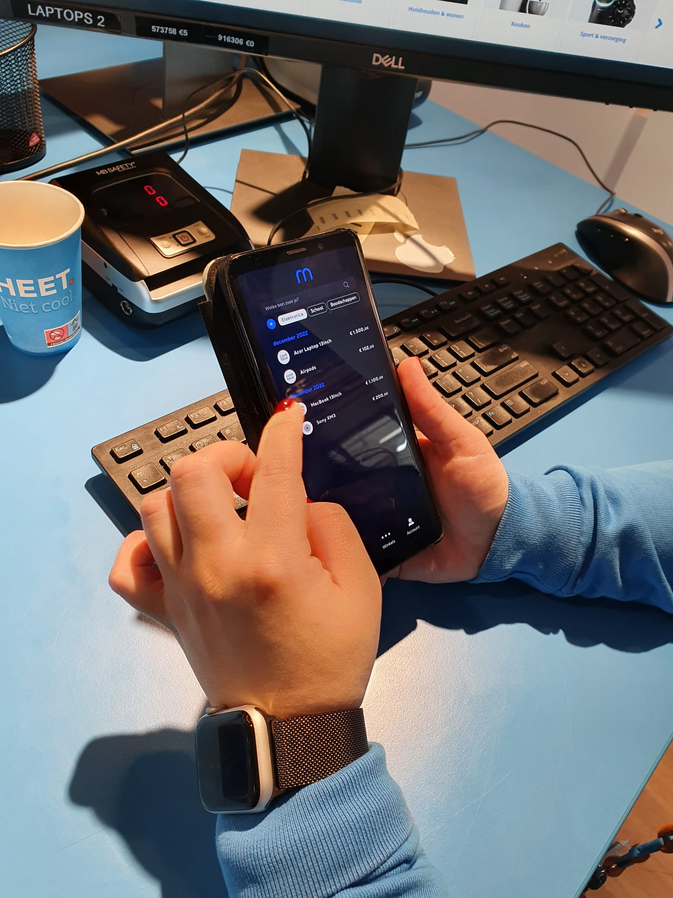
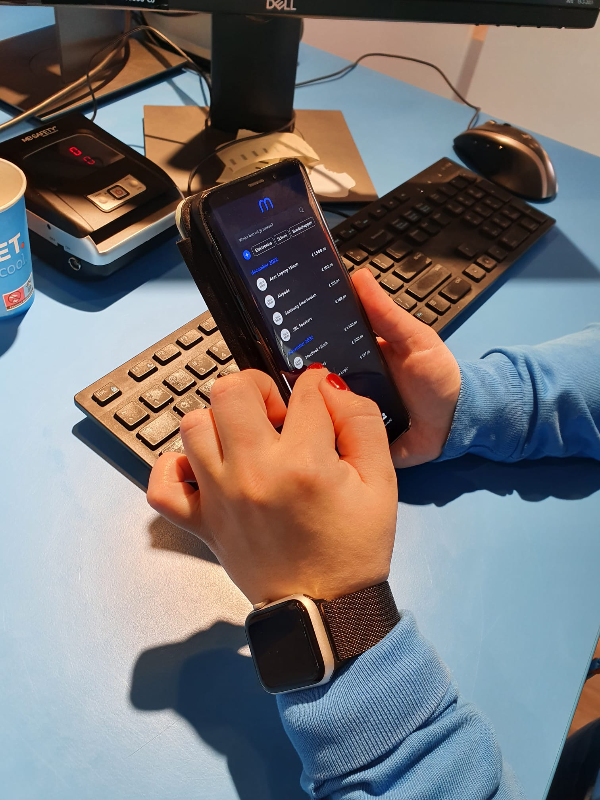
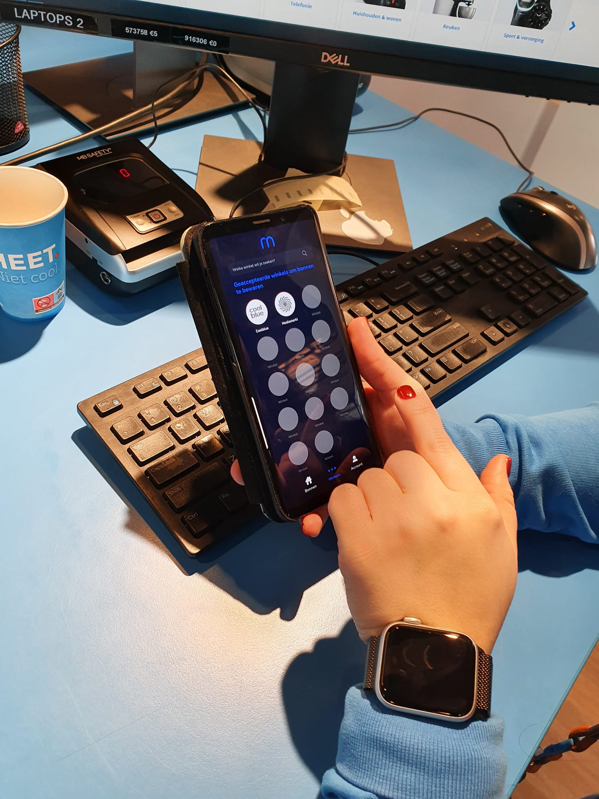

# Expert Review

**Vragen**

* Is het milieu volgens jullie een belangrijke criteria om aan bij te dragen?&#x20;
* Voldoet dit aan alle functionele eisen?&#x20;
* Wordt het eenvoudig bewaren van kassabonnen hiermee effectief aangepakt?&#x20;
* Lost dit de behoeften van jullie gebruikers op? \

**Punten waar ik feedback over wil:**\
\
\- Zijn de stappen logisch hoe je de bon bewaart en kunt gebruiken?\
\- Welke acties of uitleg missen jullie in de app, of zouden jullie graag toevoegen? \
\- Wat zou jullie klant helpen om de werking van de app te begrijpen? \
\- Wat vinden jullie belangrijk aan de app? \
****\
**Vraag 1**\
****\
****Je gebruikt de app voor het eerst en wilt een indruk krijgen. Open de app en ga aan de slag.

**Vraag 2**&#x20;

Je komt erachter dat je met de app bonnen automatisch kunt bewaren. Gebruik een deel van je IBAN om te kijken of je de bon kunt ontvangen.

**Vraag 3**&#x20;

Je wilt een van jouw bonnen snel vinden. Probeer een van de functies uit om je bon te zoeken.

**Vraag 4**

Je wilt gebruikmaken van de garantie voor je product. Open de bon en gebruik de barcode.

**Vraag 5**

Je wilt de app eigen maken en om je bonnen beter te vinden. Ga opzoek naar de plek om je account en instellingen aan te passen.&#x20;

**Vraag 6**&#x20;

Je bedenkt je dat je meerdere bankpasjes hebt. Kijk of jij van omgeving kunt wisselen om je bonnen in op te slaan.&#x20;

**Vraag 7**&#x20;

Je wilt kijken voor welke winkels je bonnen kunt bewaren. Bekijk het aanbod van de app door naar de pagina met alle winkels te navigeren.\

**Sara Coolblue Medewerker (24)**&#x20;

********.jpeg>)****.jpeg>)****.jpeg>)****************************

**Waarom is zij een belanghebbende testpersoon?** Ik denk dat Sara meer kan vertellen over de belangen van Coolblue en feedback kan geven over de werking van de app in winkel en hoe dit wordt ontvangen.\
\
Belangrijkste feedback punten:\
\- Ik vind de complete uitstraling van de app heel zakelijk, en informerend\
\- Het past bij Coolblue\
\- Als iemand een anoniem en snelle koper is werkt dit heel efficient\
\- Als ik mij aanmeld wil ik wat meer uitleg\
\- Ik vind de functies van de app intuïtief \
\- Het werkt goed voor klanten omdat zij bijna niks hoeven te doen\
\- Ik weet niet of winkels hier voor open staan omdat je eerst de winkels zou moeten aanmelden. De oplossing is wel nodig. \
\- Het is logisch, direct, automatisch\
\- Je zou wat meer instellingen kunnen toevoegen, nog niet genoeg\
\- Ik vind het idee interessant \
\- Meer organiseren, en aanpassen om je bonnen te beheren\
\-  Bewaren is al goed, en "ik hoop dat het werkt als voorstel voor het milieu". \

**Conclusie:**

De feedback van de belanghebbende was nuttig voor hoe zij en hun klant de app ervaart. De stappen hebben wat verbetering nodig maar het idee is functioneel. Ik kreeg al een hoop positieve feedback op de werking en de look & feel. Het kan uiteindelijk uitdagend worden om te implementeren in de winkel maar dit idee om het gebruiksgemak en het milieu te bevorderen werd goed op gereageerd.

****

