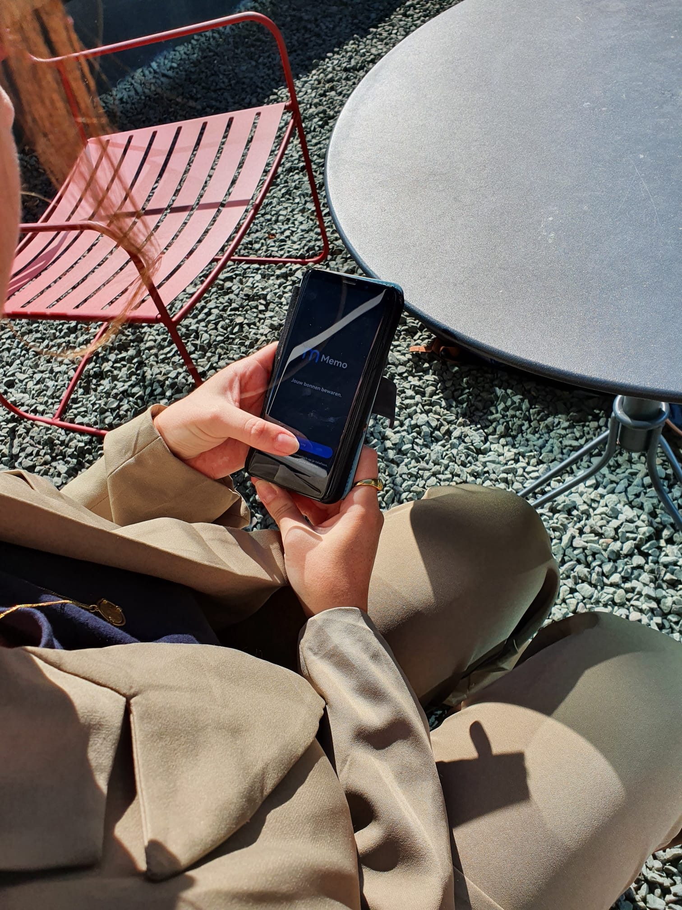

# Proof of Concept 2

Om te testen heb ik een aantal mensen gevraagd om te kijken hoe de app aanvoelt en werkt. Daarom heb ik eerst een iteratie van het prototype (Hi-Fi). Ook heb ik zonder vragen geobserveerd zodat de doelgroep zich in de app kan inleven en ik dit goed kan noteren.  \
\
Dit heb ik een tweede keer gedaan om te kijken of het prototype nu bijna foutloos is. Waar het eerst fout ging tijdens mijn eerste proof of concept met de IBAN en omdat ik het Hi-Fi wilde maken. Ik deed de tests met mensen op straat en in het winkelcentrum.&#x20;

**Testpersoon 1 Martijn, makelaar (35)**

.jpeg>) (1).jpeg>).jpeg>).jpeg>) (1).jpeg>).jpeg>)

1. **Hoe oud ben je** \
   35 jaar&#x20;
2. **Vind jij het veilig om je IBAN te gebruiken voor een app?** \
   Houd gegevens voor zichzelf maar ziet geen probleem met het delen van zijn IBAN&#x20;
3. **Bewaar jij jouw bonnen? Hoevaak?**\
   Ik bewaar alleen bonnen van dure aankopen.&#x20;
4. **Ben je bewust van het effect dat bonnen kunnen hebben op het milieu?** \
   Wel bekend met het feit dat het slecht is voor het milieu maar houd zich er niet mee bezig
5. **Wat voor winkels bezoek je in je vrije tijd en zou je een bon voor bewaren?** \
   Op dit moment alleen electronica zaken, hier bewaar ik mijn kassabonnen voor, of soms boodschappen
6. **Zou je de app gebruiken (na testplan) voor jouw gemak of voor het milieu?**\
   In combinatie van gemak om het te bewaren en voor het milieu zou ik de app willen gebruiken.&#x20;

* Meld je aan in de app\
  &#x20;\- Slaat de uitleg onder de knop van de registratie over \
  &#x20;\- Begrijpt waar de IBAN voor wordt gebruikt
* Krijg een indruk van hoe je een aankoopbon ontvangt

\- Verteld dat hij eerst zijn e-mail wilt invullen, maar daarna rinkelt er een belletje dat hij dit niet voor elke winkel zou invullen, dus vindt hij het de bon automatisch krijgen handig&#x20;

* Zoek een bon via een van de zoekopties\
  \- Hij vindt direct een bon via het overzichtsscherm\
  \- Gebruikt de zoekknop bovenaan \
  \- Hij vindt de omgeving erg duidelijk
* Open en gebruik een bon voor je garantiebewijs\
  \- Hij opent een van de bonnen en gaat makkelijk overweg met de bon lezen en de QR code vinden
* Bekijk het winkel aanbod van de app\
  \- Ik vind dat er meer winkels moeten zijn\
  \- Begrijpt dat het veel moeite kost om elke winkel voor te app aan te melden\
  \- Snapt waarom een lijst met winkels is\
  \- "Ik vind dit wel handig omdat het overkoepelend is en je voor elke winkel je bon kunt bewaren"&#x20;
* Krijg een indruk van de instellingen en tags om sneller een bon te vinden\
  \
  \- Ik vind de tags wel een leuke toevoegen maar ik kijk snel via de zoekknop\
  \- De instellingen zijn logisch, ik zou de bon via een melding accepteren&#x20;
* Wissel van omgeving om je andere bonnen te zien\
  \- "Het is net zoals Google of een account omgeving, dat begreep ik wel ja"&#x20;

**Testpersoon 2 Lois, barista (23)**&#x20;

.jpeg>).jpeg>).jpeg>)

1. **Hoe oud ben je** \
   23 jaar&#x20;
2. **Vind jij het veilig om je IBAN te gebruiken voor een app?** \
   Alleen als de app betrouwbaar is, wanneer? Als ik de app herken en alleen een deel van mijn rekeningnummer hoef te gebruiken
3. **Bewaar jij jouw bonnen? Hoevaak?**\
   Soms
4. **Ben je bewust van het effect dat bonnen kunnen hebben op het milieu?** \
   "Ik wist wel van de hoeveelheid bonnen af, maar niet van de giftige stoffen nee, ik zou de app wel gebruiken om mee te doen aan het milieu en omdat het makkelijker is
5. **Wat voor winkels bezoek je in je vrije tijd?** \
   Soms kleding winkels waar ik de bon bewaar maar ik shop veel online dus krijg ik een bon via de mail.
6. **Zou je de app gebruiken (na het testplan) voor jouw gemak of voor het milieu gebruiken?** \
   Ja ik zou de app gebruiken voor het milieu

* Meld je aan in de app \
  \-  Ik vind het wel duidelijk dat ik mijn IBAN moet gebruiken. "Ik denk dat de winkel mijn kassabon hier naartoe moet sturen?"&#x20;
* Krijg een indruk van hoe je een aankoopbon ontvangt\
  \- Ik zie een lijst met bonnen en ik verwacht een bon op mijn telefoon als ik betaal"&#x20;
* Zoek een bon via een van de zoekopties\
  \- Ik zou bijna altijd de zoekknop gebruiken ja, ik vind de tags wel een leuke optie maar zoeken is handiger
* Open en gebruik een bon voor je garantiebewijs\
  \- Dit lijkt op een normale bon en snel om te vinden, ik zie best snel de barcode die ik moet gebruiken
* Bekijk het winkel aanbod van de app\
  \- Ik zie nog maar een winkel maar ik denk dat ik hier bonnen voor kan bewaren, ik weet nog niet waar ik op kan klikken. Ze kwam er wel achter maar ik denk dat het een duidelijke zin nodig heeft
* Krijg een indruk van de instellingen en tags om sneller een bon te vinden\
  \- "Ja ik zou did ongeveer hetzelfde doen met de zoekknop"\
  \- "Nu ik een van de tags aanklik kan ik de bonnen wel bij elkaar houden"\
  \- "Ik vind het heel interessant om je bonnen te exporteren dus dat heb je echt goed bedacht"
*   Wissel van omgeving om je andere bonnen te zien\
    \- "Ooh dit is wel cool, ik kan dus een ander bankpasje gebruiken"\
    \
    \
    **Testpersoon 3 Lisa, Data scientist (23)**&#x20;

    1. **Hoe oud ben je** \
       23 jaar&#x20;
    2. **Vind jij het veilig om je IBAN te gebruiken voor een app?** \
       Ik vind het geen probleem om mijn IBAN in te voeren, dat heeft Tikkie toch ook?
    3. **Bewaar jij jouw bonnen? Hoevaak?**\
       Niet zoveel, soms wel van de supermarkten of van een duur product
    4. **Ben je bewust van het effect dat bonnen kunnen hebben op het milieu?** \
       "Nee ik had geen idee, maar dat zijn er wel veel ja"&#x20;
    5. **Wat voor winkels bezoek je in je vrije tijd?** \
       Ik shop meestal online
    6. **Zou je de app gebruiken (na het testplan) voor jouw gemak of voor het milieu gebruiken?** \
       Ik vind het handig, de omgeving van de app zag er ook makkelijk uit

* Meld je aan in de app \
  \-  "Dit is logisch wat het moet doen" \
  \- "Ik had de teksten tijdens het openen van de app niet gelezen"&#x20;
* Krijg een indruk van hoe je een aankoopbon ontvangt\
  \- "Ik begrijp hoe de app met mijn IBAN werkt, maar ik weet niet of dit in de echte wereld werkt"
* Zoek een bon via een van de zoekopties\
  \- "Ik zou het gewoon zoeken, en het ligt eraan wat ik moet zoeken"\
  \- "Je kunt ook nadenken over het feit dat mensen veel bonnen kunnen bewaren, dus zoeken moet erg makkelijk gaan"
* Open en gebruik een bon voor je garantiebewijs\
  \- "Dit is zoals een bon eruitziet, mijn enigste vraag is wat als je meerdere producten hebt" (dit kan ik dus specificeren ookal staat er een dropdown knop"&#x20;
* Bekijk het winkel aanbod van de app\
  \- "Ik wil de app gebruiken voor meer winkels, en wat gebeurt er als ik op de cirkels klik?" (mijn antwoord was dat je de bonnen van de winkel openklapt) en dat vond ze duidelijk
* Krijg een indruk van de instellingen en tags om sneller een bon te vinden\
  \- "Mijn enigste vraag is waarom exporteren dicht onder de instelling staat om bonnen automatisch te krijgen of pushnotificatie"\
  \- Ik: kun je zien dat exporteren een actie is? "Het valt niet genoeg op"&#x20;
* Wissel van omgeving om je andere bonnen te zien\
  \- "Ik zie dat je hier meerdere pasjes kunt toevoegen".&#x20;

**Testpersoon 4 Roy, Student (27)**&#x20;

<figure><figcaption></figcaption></figure>

<figure><figcaption></figcaption></figure>

.jpg>)

1. **Hoe oud ben je** \
   27 jaar&#x20;
2. **Vind jij het veilig om je IBAN te gebruiken voor een app?** \
   "Ik doe het meestal niet, alleen als het nodig is zoals voor mijn bank"
3. **Bewaar jij jouw bonnen? Hoevaak?**\
   "Ik bewaar bonnen van dure uitgaven ja"
4. **Ben je bewust van het effect dat bonnen kunnen hebben op het milieu?** \
   "Nee"
5. **Wat voor winkels bezoek je in je vrije tijd?** \
   "Eigenlijk alleen kleding winkels"
6. **Zou je de app gebruiken (na het testplan) voor jouw gemak of voor het milieu gebruiken?** \
   **"**Ik zou de app gebruiken voor het milieu omdat ik bonnen niet handig vindt" \

7. Meld je aan in de app \
   \-  "Het verteld wat ik moet doen, en ik kan eigenlijk alleen maar verder dus ja" \
   \- "Ik weet niet wat de IBAN doet maar als het veilig is vind ik het niet erg"&#x20;
8. Krijg een indruk van hoe je een aankoopbon ontvangt\
   \- "Geen idee"\
   \- Ik zie wel dat het automatisch kan"
9. Zoek een bon via een van de zoekopties\
   \- Via zoeken\
   \- Kijkt in de lijst&#x20;
10. Open en gebruik een bon voor je garantiebewijs\
    \- "Dit lijkt op een bon, maar dan makkelijker gemaakt"&#x20;
11. Bekijk het winkel aanbod van de app\
    \- "Ik heb nog geen keuze maar dit zijn de winkels waar ik bonnen voor kan bewaren?"&#x20;
12. Krijg een indruk van de instellingen en tags om sneller een bon te vinden\
    \- Mijn eerste indruk is dat ik kan kiezen wanneer ik de bon bewaar"&#x20;
13. Wissel van omgeving om je andere bonnen te zien\
    \- "Dit is wel duidelijk"&#x20;

## Hi-Fi Prototype User Tests

<figure><figcaption></figcaption></figure>

<figure><figcaption></figcaption></figure>

<figure><figcaption></figcaption></figure>

<figure><figcaption></figcaption></figure>

<figure><figcaption></figcaption></figure>
