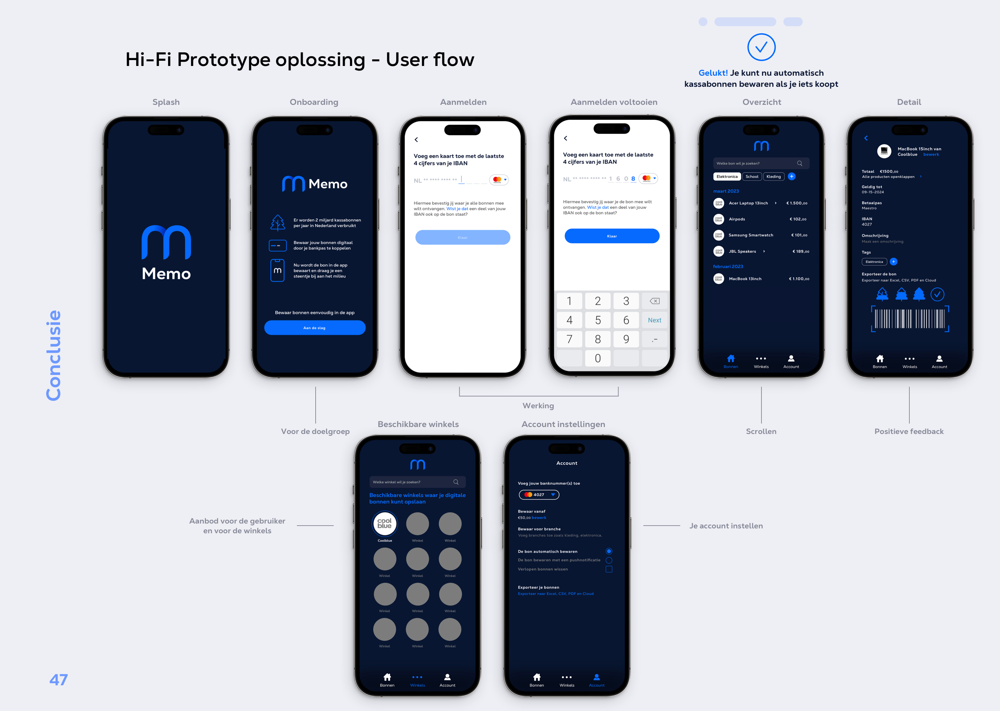
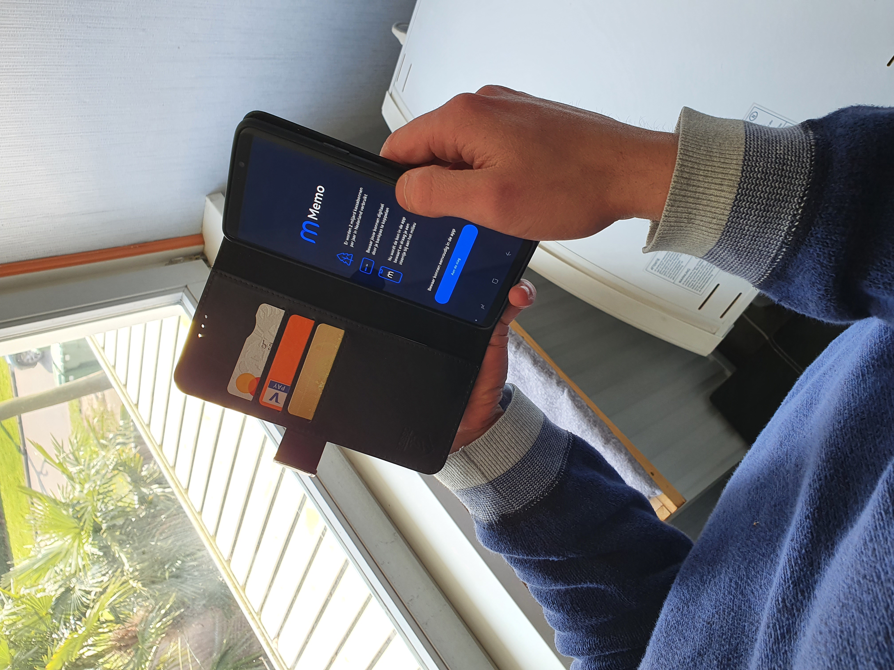

# 📱 Hi-Fi Prototype oplossing

### **Oplossing**

Uit de gesprekken blijkt dat het prototype succesvol is en dat de gebruiker dit graag zou willen gebruiken. Voor het milieu en een betere ervaring. De werking is nu functioneel en duidelijk geworden. Gebruikers willen meer om een app dagelijks te gebruiken, zoals kosten delen aan de hand van de kassabon. Mijn focus tijdens dit project lag op de automatische werking en het gebruiksgemak en daarom ben ik er zeer tevreden over. Ook vind ik de feedback die ik heb opgedaan handig door de gesprekken die ik met de doelgroep en de winkel heb gehouden. Alleen voor een implementatie met de winkel moet de API verder worden ontwikkeld. De uitdaging is beantwoord met mijn concept.

<figure><figcaption>
De flow van het product
</figcaption></figure>

**Link naar het prototype:** [**https://xd.adobe.com/view/425bf939-6c03-4214-ba25-aa3690b077ea-1708/**](https://xd.adobe.com/view/425bf939-6c03-4214-ba25-aa3690b077ea-1708/)

**Memo UX Prototype Video:**



<figure><figcaption>
Foto van het product met de doelgroep
</figcaption></figure>

<figure><figcaption>
Foto van het product
</figcaption></figure>

<figure><figcaption>
Foto van het product met een peer
</figcaption></figure>

<figure><figcaption>
Test van het product met mijn belanghebbende
</figcaption></figure>
