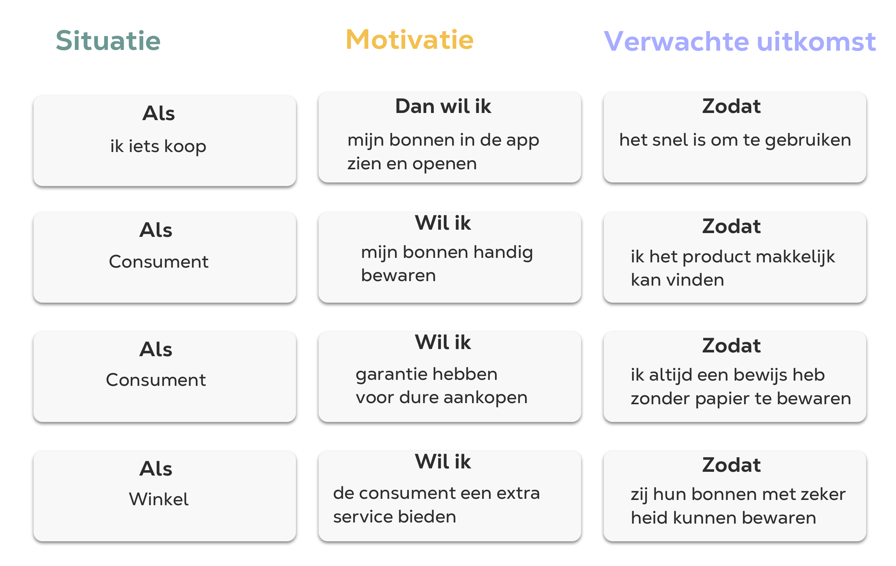

# Job Stories

<figure><figcaption>
Job Stories v1
</figcaption></figure>

Na alle HKJ’s en schets uitwerkingen ben ik begonnen met Job Stories. Na feedback van de groep en Robert bleek een User Story niet handig. De Job Stories geven daarentegen inzicht in wat de consumenten vs de winkels willen. Deze job stories heb ik gemaakt voor klanten, zzp'ers en wanneer/als scenario's. Deze zijn nog te uitgebreid en ik wil twee job stories kunnen kiezen. Wat duidelijk aan moet sluiten op wat een consument doet (iets kopen) dan een bon veilig opbergen om het vervolgens te gebruiken. Dit wil ik concreet maken.&#x20;

<figure><figcaption>
Job Stories v2
</figcaption></figure>

Dit zijn duidelijk Job Stories om te gebruiken als uitgangspunt van mijn concept. Alle behoeften zijn hier beschreven, en waar ik aan moet voldoen. Namelijk wat ik zeg, voor mijn band met winkels en de consumenten. Hier zijn kenmerken erg belangrijk, in welke situatie, iets snel moet, makkelijk moet of veilig moet worden opgeborgen (met zekerheid).&#x20;
