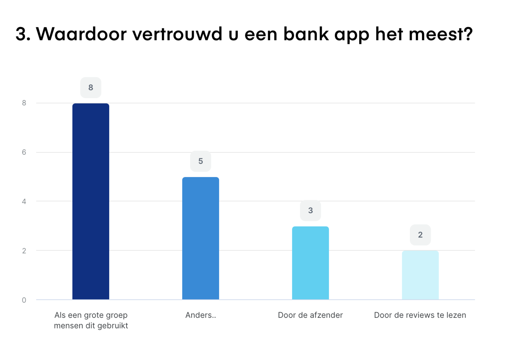

# Groenlicht Presentatie

Link naar de presentatie: \
[https://acrobat.adobe.com/link/review?uri=urn:aaid:scds:US:e1d5be58-58d6-3150-a7c8-0c2e5f939603](https://acrobat.adobe.com/link/review?uri=urn:aaid:scds:US:e1d5be58-58d6-3150-a7c8-0c2e5f939603)

<figure><figcaption>
Opening van de presentatie
</figcaption></figure>

<figure><figcaption>
Dia over de app
</figcaption></figure>

<figure><figcaption>
Dia van het prototype
</figcaption></figure>

<figure><figcaption></figcaption></figure>

<figure><figcaption></figcaption></figure>

<figure><figcaption></figcaption></figure>

<figure><figcaption></figcaption></figure>

<figure><figcaption></figcaption></figure>

<figure><figcaption></figcaption></figure>

<figure><figcaption></figcaption></figure>

<figure><figcaption></figcaption></figure>

<figure><figcaption></figcaption></figure>

<figure><figcaption></figcaption></figure>

<figure><figcaption></figcaption></figure>

<figure><figcaption></figcaption></figure>

<figure><figcaption></figcaption></figure>

<figure><figcaption></figcaption></figure>

<figure><figcaption></figcaption></figure>

<figure><figcaption></figcaption></figure>

<figure><figcaption></figcaption></figure>

<figure><figcaption></figcaption></figure>

<figure><figcaption></figcaption></figure>

<figure><figcaption></figcaption></figure>

<figure><figcaption></figcaption></figure>

<figure><figcaption></figcaption></figure>

<figure><figcaption></figcaption></figure>

<figure><figcaption></figcaption></figure>

<figure><figcaption></figcaption></figure>

<figure><figcaption></figcaption></figure>

<figure><figcaption></figcaption></figure>

<figure><figcaption></figcaption></figure>

<figure><figcaption>
 
</figcaption></figure>
