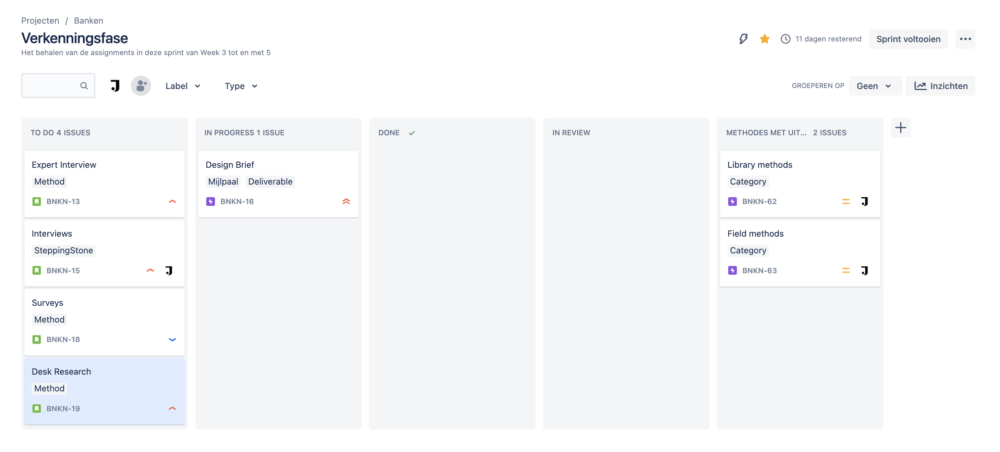

# Overzicht


Planning naar mijn Jira


_Hier geef ik mijn volledige planning. Dit kan op het wekelijkse Jira bord veranderen, als ik taken verschuif en methodes aanpas_

<figure><figcaption>
Sprint Planning
</figcaption></figure>

<figure><figcaption>
Backlog planning van de eerste en tweede fase
</figcaption></figure>

<figure><figcaption>
Backlog planning van de derde en de vierde fase
</figcaption></figure>

<figure><figcaption>
Backlog planning van de vijfde en zesde fase
</figcaption></figure>

<figure><figcaption>
Backlog planning van de zevende en laatste fase
</figcaption></figure>
